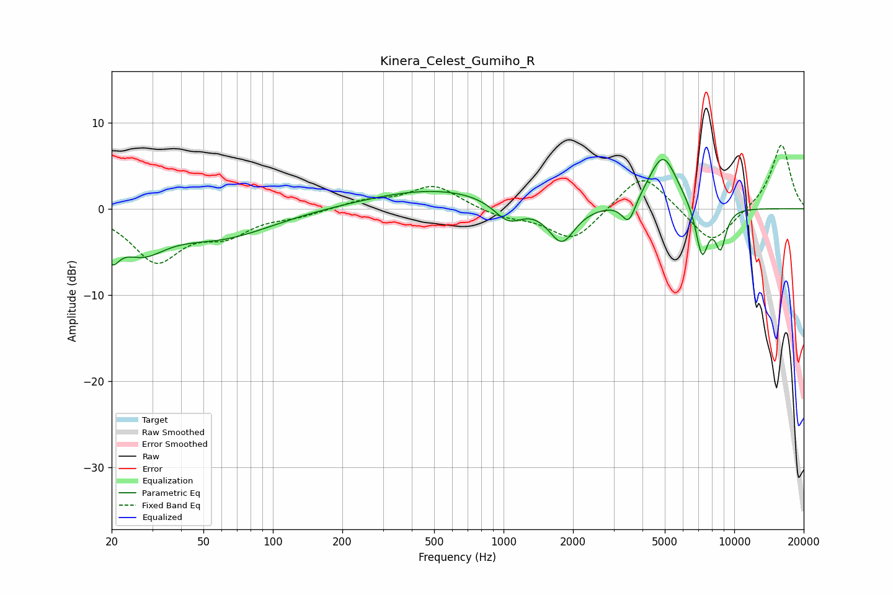

# Kinera_Celest_Gumiho_R
See [usage instructions](https://github.com/jaakkopasanen/AutoEq#usage) for more options and info.

### Parametric EQs
Apply preamp of -5.8 dB when using parametric equalizer.

|   # | Type    |   Fc (Hz) |    Q |   Gain (dB) |
|-----|---------|-----------|------|-------------|
|   1 | Peaking |        20 | 4.31 |        -3.3 |
|   2 | Peaking |        27 | 1.35 |        -3.9 |
|   3 | Peaking |        60 | 0.64 |        -3.1 |
|   4 | Peaking |       520 | 0.47 |         2.3 |
|   5 | Peaking |      1047 | 2.27 |        -2.4 |
|   6 | Peaking |      1786 | 2.49 |        -4.3 |
|   7 | Peaking |      3488 | 4.7  |        -2.8 |
|   8 | Peaking |      4910 | 2.15 |         6.3 |
|   9 | Peaking |      7249 | 4.81 |        -6   |
|  10 | Peaking |      8722 | 5.26 |        -4.4 |

### Fixed Band EQs
When using fixed band (also called graphic) equalizer, apply preamp of **-7.5 dB** (if available) and set gains manually with these parameters.

|   # | Type    |   Fc (Hz) |    Q |   Gain (dB) |
|-----|---------|-----------|------|-------------|
|   1 | Peaking |        31 | 1.41 |        -5.9 |
|   2 | Peaking |        62 | 1.41 |        -2.5 |
|   3 | Peaking |       125 | 1.41 |        -0.7 |
|   4 | Peaking |       250 | 1.41 |         0.9 |
|   5 | Peaking |       500 | 1.41 |         2.7 |
|   6 | Peaking |      1000 | 1.41 |        -0.9 |
|   7 | Peaking |      2000 | 1.41 |        -3.8 |
|   8 | Peaking |      4000 | 1.41 |         4.5 |
|   9 | Peaking |      8000 | 1.41 |        -4.3 |
|  10 | Peaking |     16000 | 1.41 |         7.6 |

### Graphs

