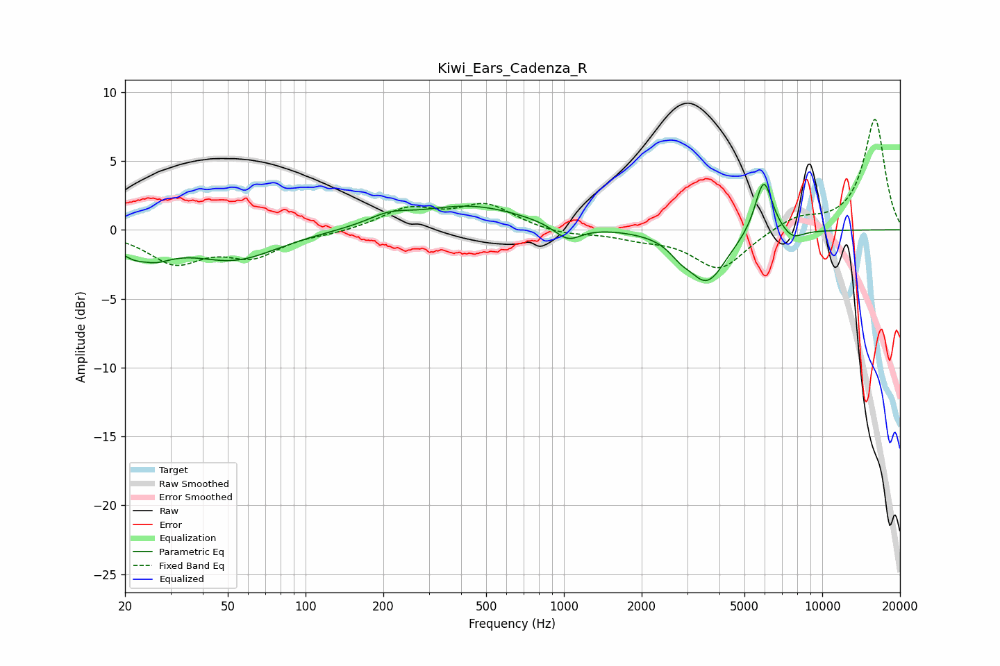

# Kiwi_Ears_Cadenza_R
See [usage instructions](https://github.com/jaakkopasanen/AutoEq#usage) for more options and info.

### Parametric EQs
Apply preamp of -3.4 dB when using parametric equalizer.

|   # | Type    |   Fc (Hz) |    Q |   Gain (dB) |
|-----|---------|-----------|------|-------------|
|   1 | Peaking |        24 | 1.81 |        -2.4 |
|   2 | Peaking |        24 | 3.35 |         0.7 |
|   3 | Peaking |        53 | 0.84 |        -2.1 |
|   4 | Peaking |       210 | 1.76 |         0.7 |
|   5 | Peaking |       433 | 0.67 |         1.7 |
|   6 | Peaking |      1036 | 2.7  |        -1.1 |
|   7 | Peaking |      2808 | 3.66 |        -0.6 |
|   8 | Peaking |      3576 | 1.87 |        -3.7 |
|   9 | Peaking |      5937 | 4.01 |         4.1 |
|  10 | Peaking |      7674 | 3.21 |        -0.7 |

### Fixed Band EQs
When using fixed band (also called graphic) equalizer, apply preamp of **-8.1 dB** (if available) and set gains manually with these parameters.

|   # | Type    |   Fc (Hz) |    Q |   Gain (dB) |
|-----|---------|-----------|------|-------------|
|   1 | Peaking |        31 | 1.41 |        -2.3 |
|   2 | Peaking |        62 | 1.41 |        -1.7 |
|   3 | Peaking |       125 | 1.41 |        -0.2 |
|   4 | Peaking |       250 | 1.41 |         1.5 |
|   5 | Peaking |       500 | 1.41 |         1.8 |
|   6 | Peaking |      1000 | 1.41 |        -0.4 |
|   7 | Peaking |      2000 | 1.41 |        -0.5 |
|   8 | Peaking |      4000 | 1.41 |        -2.9 |
|   9 | Peaking |      8000 | 1.41 |         0.9 |
|  10 | Peaking |     16000 | 1.41 |         8   |

### Graphs

