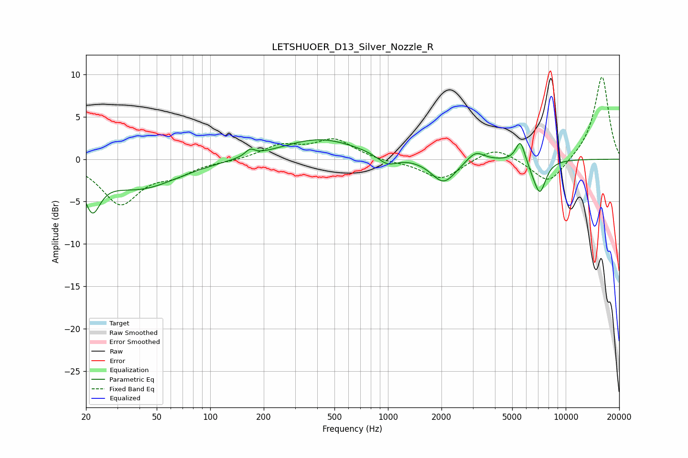

# LETSHUOER_D13_Silver_Nozzle_R
See [usage instructions](https://github.com/jaakkopasanen/AutoEq#usage) for more options and info.

### Parametric EQs
Apply preamp of -2.4 dB when using parametric equalizer.

|   # | Type    |   Fc (Hz) |    Q |   Gain (dB) |
|-----|---------|-----------|------|-------------|
|   1 | Peaking |        22 | 3.21 |        -4.4 |
|   2 | Peaking |        40 | 0.65 |        -3.4 |
|   3 | Peaking |       168 | 5.35 |         0.8 |
|   4 | Peaking |       412 | 0.65 |         2.4 |
|   5 | Peaking |       991 | 2.58 |        -1.2 |
|   6 | Peaking |      2057 | 2.05 |        -2.9 |
|   7 | Peaking |      3112 | 2.91 |         1.3 |
|   8 | Peaking |      5558 | 5.38 |         2.6 |
|   9 | Peaking |      6519 | 4.91 |        -0.5 |
|  10 | Peaking |      7163 | 3.98 |        -3.8 |

### Fixed Band EQs
When using fixed band (also called graphic) equalizer, apply preamp of **-9.8 dB** (if available) and set gains manually with these parameters.

|   # | Type    |   Fc (Hz) |    Q |   Gain (dB) |
|-----|---------|-----------|------|-------------|
|   1 | Peaking |        31 | 1.41 |        -5.1 |
|   2 | Peaking |        62 | 1.41 |        -1.5 |
|   3 | Peaking |       125 | 1.41 |        -0.2 |
|   4 | Peaking |       250 | 1.41 |         1.5 |
|   5 | Peaking |       500 | 1.41 |         2.3 |
|   6 | Peaking |      1000 | 1.41 |        -0.3 |
|   7 | Peaking |      2000 | 1.41 |        -2.4 |
|   8 | Peaking |      4000 | 1.41 |         1.6 |
|   9 | Peaking |      8000 | 1.41 |        -3.1 |
|  10 | Peaking |     16000 | 1.41 |         9.9 |

### Graphs

