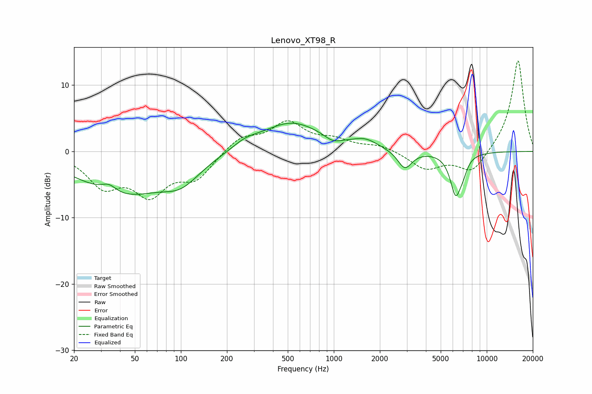

# Lenovo_XT98_R
See [usage instructions](https://github.com/jaakkopasanen/AutoEq#usage) for more options and info.

### Parametric EQs
Apply preamp of -4.4 dB when using parametric equalizer.

|   # | Type    |   Fc (Hz) |    Q |   Gain (dB) |
|-----|---------|-----------|------|-------------|
|   1 | Peaking |        34 | 2.86 |         1.3 |
|   2 | Peaking |        41 | 0.5  |        -6.3 |
|   3 | Peaking |       101 | 1.17 |        -2.9 |
|   4 | Peaking |       263 | 1.71 |         1   |
|   5 | Peaking |       528 | 0.7  |         4.4 |
|   6 | Peaking |       985 | 2.74 |        -0.9 |
|   7 | Peaking |      1607 | 1.75 |         1.2 |
|   8 | Peaking |      2912 | 3.07 |        -2.8 |
|   9 | Peaking |      6267 | 3.75 |        -6.2 |
|  10 | Peaking |      7001 | 5.09 |        -1.3 |

### Fixed Band EQs
When using fixed band (also called graphic) equalizer, apply preamp of **-13.8 dB** (if available) and set gains manually with these parameters.

|   # | Type    |   Fc (Hz) |    Q |   Gain (dB) |
|-----|---------|-----------|------|-------------|
|   1 | Peaking |        31 | 1.41 |        -4.8 |
|   2 | Peaking |        62 | 1.41 |        -5.8 |
|   3 | Peaking |       125 | 1.41 |        -3.7 |
|   4 | Peaking |       250 | 1.41 |         2.2 |
|   5 | Peaking |       500 | 1.41 |         4.1 |
|   6 | Peaking |      1000 | 1.41 |         1.4 |
|   7 | Peaking |      2000 | 1.41 |         0.9 |
|   8 | Peaking |      4000 | 1.41 |        -2.6 |
|   9 | Peaking |      8000 | 1.41 |        -3.3 |
|  10 | Peaking |     16000 | 1.41 |        14   |

### Graphs

