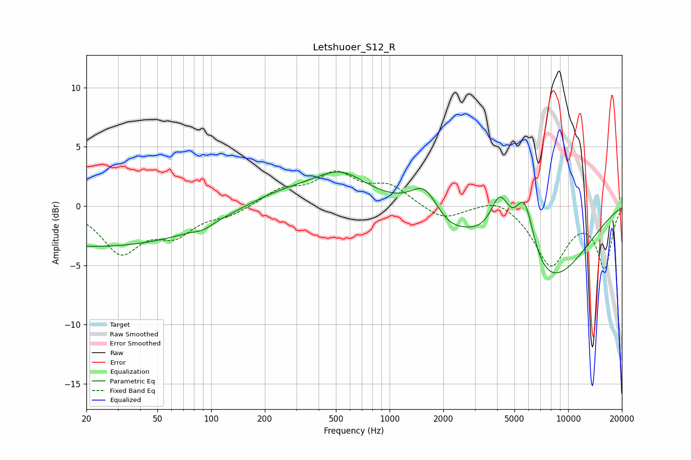

# Letshuoer_S12_R
See [usage instructions](https://github.com/jaakkopasanen/AutoEq#usage) for more options and info.

### Parametric EQs
Apply preamp of -3.0 dB when using parametric equalizer.

|   # | Type    |   Fc (Hz) |    Q |   Gain (dB) |
|-----|---------|-----------|------|-------------|
|   1 | Peaking |        21 | 0.18 |        -3.5 |
|   2 | Peaking |        21 | 4.34 |         0   |
|   3 | Peaking |        90 | 3.08 |        -0.3 |
|   4 | Peaking |       242 | 0.62 |         1.3 |
|   5 | Peaking |       533 | 0.94 |         2.4 |
|   6 | Peaking |      1570 | 1.84 |         2.3 |
|   7 | Peaking |      2128 | 1.67 |        -1   |
|   8 | Peaking |      4148 | 2.51 |         4.2 |
|   9 | Peaking |      5701 | 2.44 |         5.8 |
|  10 | Peaking |      7040 | 0.53 |        -7.2 |

### Fixed Band EQs
When using fixed band (also called graphic) equalizer, apply preamp of **-3.1 dB** (if available) and set gains manually with these parameters.

|   # | Type    |   Fc (Hz) |    Q |   Gain (dB) |
|-----|---------|-----------|------|-------------|
|   1 | Peaking |        31 | 1.41 |        -3.7 |
|   2 | Peaking |        62 | 1.41 |        -2.1 |
|   3 | Peaking |       125 | 1.41 |        -0.7 |
|   4 | Peaking |       250 | 1.41 |         1.3 |
|   5 | Peaking |       500 | 1.41 |         2.5 |
|   6 | Peaking |      1000 | 1.41 |         1.6 |
|   7 | Peaking |      2000 | 1.41 |        -1.2 |
|   8 | Peaking |      4000 | 1.41 |         0.9 |
|   9 | Peaking |      8000 | 1.41 |        -4.9 |
|  10 | Peaking |     16000 | 1.41 |        -5.1 |

### Graphs

