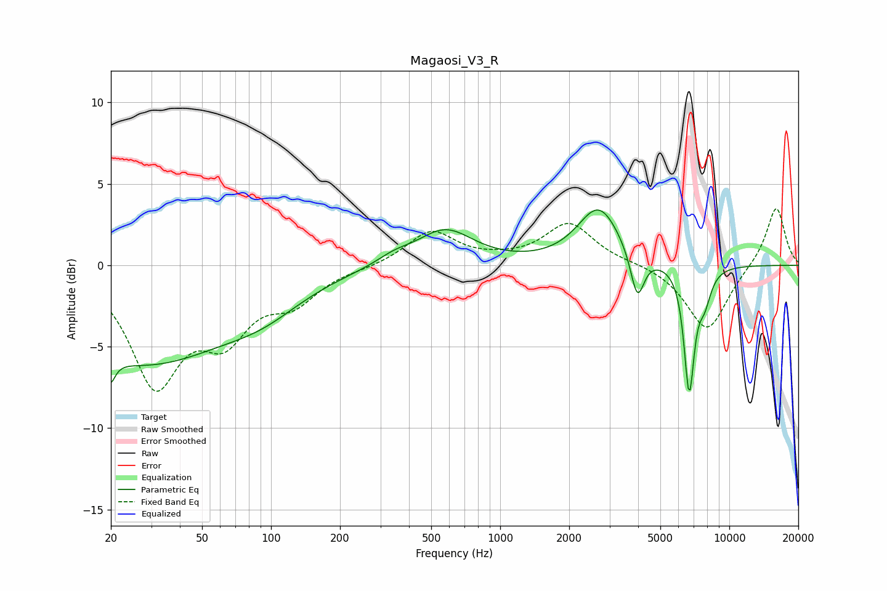

# Magaosi_V3_R
See [usage instructions](https://github.com/jaakkopasanen/AutoEq#usage) for more options and info.

### Parametric EQs
Apply preamp of -3.5 dB when using parametric equalizer.

|   # | Type    |   Fc (Hz) |    Q |   Gain (dB) |
|-----|---------|-----------|------|-------------|
|   1 | Peaking |        20 | 5.74 |        -4.9 |
|   2 | Peaking |        20 | 5.61 |         3.4 |
|   3 | Peaking |        27 | 0.36 |        -5.9 |
|   4 | Peaking |        93 | 0.82 |        -1.3 |
|   5 | Peaking |       344 | 1.83 |         0.5 |
|   6 | Peaking |       575 | 1.15 |         2.2 |
|   7 | Peaking |      2697 | 1.53 |         3.5 |
|   8 | Peaking |      3968 | 4.74 |        -2.9 |
|   9 | Peaking |      6681 | 6    |        -7.5 |
|  10 | Peaking |      7790 | 4.54 |        -1.8 |

### Fixed Band EQs
When using fixed band (also called graphic) equalizer, apply preamp of **-3.6 dB** (if available) and set gains manually with these parameters.

|   # | Type    |   Fc (Hz) |    Q |   Gain (dB) |
|-----|---------|-----------|------|-------------|
|   1 | Peaking |        31 | 1.41 |        -7   |
|   2 | Peaking |        62 | 1.41 |        -3.7 |
|   3 | Peaking |       125 | 1.41 |        -1.9 |
|   4 | Peaking |       250 | 1.41 |        -0.1 |
|   5 | Peaking |       500 | 1.41 |         2.1 |
|   6 | Peaking |      1000 | 1.41 |         0.2 |
|   7 | Peaking |      2000 | 1.41 |         2.6 |
|   8 | Peaking |      4000 | 1.41 |         0.1 |
|   9 | Peaking |      8000 | 1.41 |        -4.1 |
|  10 | Peaking |     16000 | 1.41 |         3.7 |

### Graphs

