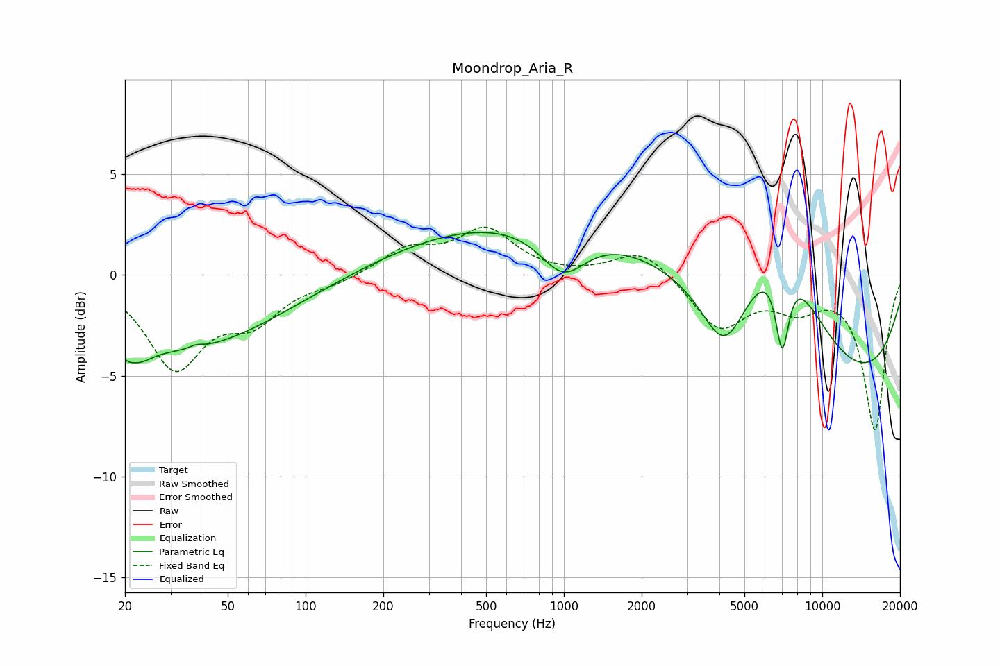

# Moondrop_Aria_R
See [usage instructions](https://github.com/jaakkopasanen/AutoEq#usage) for more options and info.

### Parametric EQs
Apply preamp of -2.2 dB when using parametric equalizer.

|   # | Type    |   Fc (Hz) |    Q |   Gain (dB) |
|-----|---------|-----------|------|-------------|
|   1 | Peaking |        20 | 5.89 |        -0.4 |
|   2 | Peaking |        22 | 2.62 |        -0.9 |
|   3 | Peaking |        33 | 0.38 |        -3.7 |
|   4 | Peaking |        38 | 5.83 |         0.2 |
|   5 | Peaking |       993 | 1.55 |        -2.3 |
|   6 | Peaking |      1148 | 0.19 |         3.1 |
|   7 | Peaking |      4177 | 1.64 |        -3.4 |
|   8 | Peaking |      6944 | 0.85 |         5.7 |
|   9 | Peaking |      7001 | 5.05 |        -4.2 |
|  10 | Peaking |     10000 | 0.24 |        -6.1 |

### Fixed Band EQs
When using fixed band (also called graphic) equalizer, apply preamp of **-2.5 dB** (if available) and set gains manually with these parameters.

|   # | Type    |   Fc (Hz) |    Q |   Gain (dB) |
|-----|---------|-----------|------|-------------|
|   1 | Peaking |        31 | 1.41 |        -4.4 |
|   2 | Peaking |        62 | 1.41 |        -2   |
|   3 | Peaking |       125 | 1.41 |        -0.3 |
|   4 | Peaking |       250 | 1.41 |         1.2 |
|   5 | Peaking |       500 | 1.41 |         2.2 |
|   6 | Peaking |      1000 | 1.41 |        -0.1 |
|   7 | Peaking |      2000 | 1.41 |         1.3 |
|   8 | Peaking |      4000 | 1.41 |        -2.6 |
|   9 | Peaking |      8000 | 1.41 |        -1.4 |
|  10 | Peaking |     16000 | 1.41 |        -7.6 |

### Graphs

