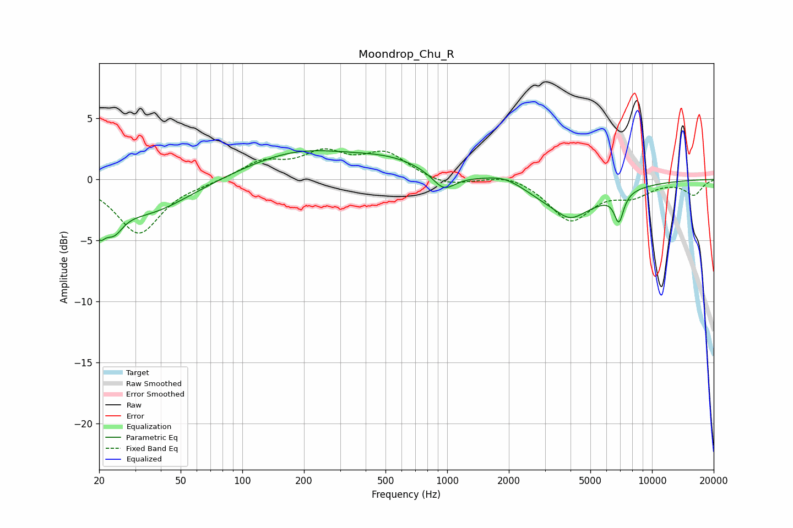

# Moondrop_Chu_R
See [usage instructions](https://github.com/jaakkopasanen/AutoEq#usage) for more options and info.

### Parametric EQs
Apply preamp of -2.4 dB when using parametric equalizer.

|   # | Type    |   Fc (Hz) |    Q |   Gain (dB) |
|-----|---------|-----------|------|-------------|
|   1 | Peaking |        20 | 5.31 |        -2.2 |
|   2 | Peaking |        23 | 3.03 |        -2.1 |
|   3 | Peaking |        34 | 0.68 |        -2.8 |
|   4 | Peaking |       190 | 0.52 |         2.2 |
|   5 | Peaking |       535 | 0.77 |         1.2 |
|   6 | Peaking |       962 | 2.54 |        -1.4 |
|   7 | Peaking |      1917 | 1.49 |         0.8 |
|   8 | Peaking |      3964 | 0.84 |        -2.6 |
|   9 | Peaking |      3984 | 2.47 |        -0.6 |
|  10 | Peaking |      6892 | 5.94 |        -2.3 |

### Fixed Band EQs
When using fixed band (also called graphic) equalizer, apply preamp of **-2.6 dB** (if available) and set gains manually with these parameters.

|   # | Type    |   Fc (Hz) |    Q |   Gain (dB) |
|-----|---------|-----------|------|-------------|
|   1 | Peaking |        31 | 1.41 |        -4.4 |
|   2 | Peaking |        62 | 1.41 |        -0.2 |
|   3 | Peaking |       125 | 1.41 |         1.4 |
|   4 | Peaking |       250 | 1.41 |         1.9 |
|   5 | Peaking |       500 | 1.41 |         2   |
|   6 | Peaking |      1000 | 1.41 |        -0.6 |
|   7 | Peaking |      2000 | 1.41 |         0.5 |
|   8 | Peaking |      4000 | 1.41 |        -3.3 |
|   9 | Peaking |      8000 | 1.41 |        -1.1 |
|  10 | Peaking |     16000 | 1.41 |        -1.2 |

### Graphs

