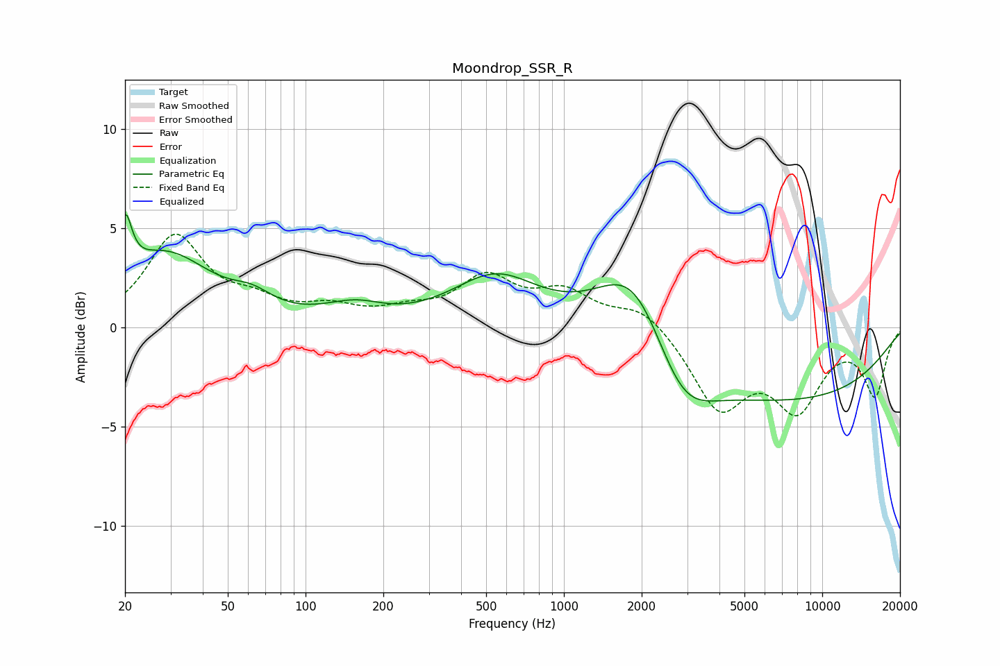

# Moondrop_SSR_R
See [usage instructions](https://github.com/jaakkopasanen/AutoEq#usage) for more options and info.

### Parametric EQs
Apply preamp of -5.8 dB when using parametric equalizer.

|   # | Type    |   Fc (Hz) |    Q |   Gain (dB) |
|-----|---------|-----------|------|-------------|
|   1 | Peaking |        20 | 5.66 |         3   |
|   2 | Peaking |        29 | 0.79 |         3.6 |
|   3 | Peaking |        62 | 1.83 |         0.7 |
|   4 | Peaking |       149 | 1.23 |         0.8 |
|   5 | Peaking |       172 | 1.94 |         0.1 |
|   6 | Peaking |       545 | 0.85 |         2.5 |
|   7 | Peaking |       724 | 2.15 |        -0   |
|   8 | Peaking |      1893 | 0.97 |         4.7 |
|   9 | Peaking |      2838 | 1.16 |        -3.2 |
|  10 | Peaking |      7031 | 0.27 |        -3.6 |

### Fixed Band EQs
When using fixed band (also called graphic) equalizer, apply preamp of **-4.8 dB** (if available) and set gains manually with these parameters.

|   # | Type    |   Fc (Hz) |    Q |   Gain (dB) |
|-----|---------|-----------|------|-------------|
|   1 | Peaking |        31 | 1.41 |         4.5 |
|   2 | Peaking |        62 | 1.41 |         1   |
|   3 | Peaking |       125 | 1.41 |         0.8 |
|   4 | Peaking |       250 | 1.41 |         0.6 |
|   5 | Peaking |       500 | 1.41 |         2.3 |
|   6 | Peaking |      1000 | 1.41 |         1.6 |
|   7 | Peaking |      2000 | 1.41 |         1.1 |
|   8 | Peaking |      4000 | 1.41 |        -3.9 |
|   9 | Peaking |      8000 | 1.41 |        -3.7 |
|  10 | Peaking |     16000 | 1.41 |        -3.3 |

### Graphs

