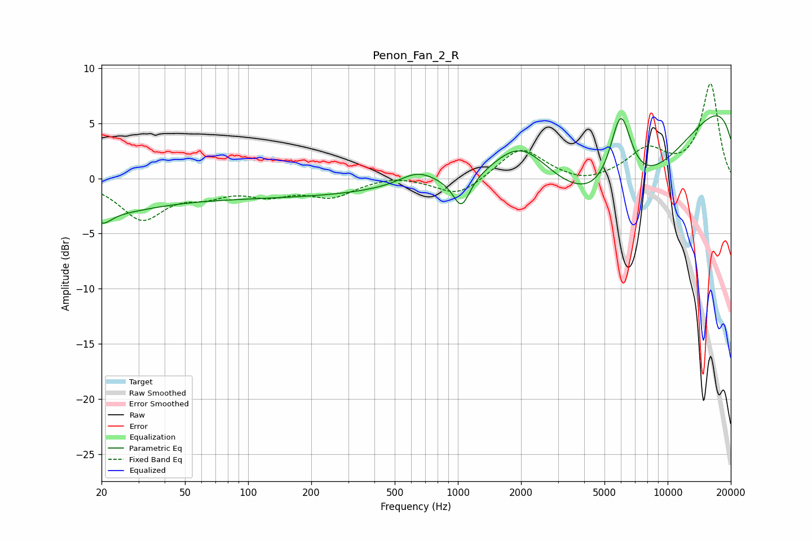

# Penon_Fan_2_R
See [usage instructions](https://github.com/jaakkopasanen/AutoEq#usage) for more options and info.

### Parametric EQs
Apply preamp of -5.8 dB when using parametric equalizer.

|   # | Type    |   Fc (Hz) |    Q |   Gain (dB) |
|-----|---------|-----------|------|-------------|
|   1 | Peaking |        20 | 0.66 |        -2.2 |
|   2 | Peaking |        21 | 4.7  |        -1.9 |
|   3 | Peaking |        21 | 5.88 |         0.9 |
|   4 | Peaking |       102 | 0.2  |        -1.7 |
|   5 | Peaking |       642 | 1.62 |         1.3 |
|   6 | Peaking |      1039 | 3.54 |        -2.8 |
|   7 | Peaking |      1991 | 0.97 |         4.6 |
|   8 | Peaking |      5779 | 0.31 |       -13.6 |
|   9 | Peaking |      5975 | 2.59 |         7.5 |
|  10 | Peaking |     10000 | 0.18 |        11.9 |

### Fixed Band EQs
When using fixed band (also called graphic) equalizer, apply preamp of **-8.7 dB** (if available) and set gains manually with these parameters.

|   # | Type    |   Fc (Hz) |    Q |   Gain (dB) |
|-----|---------|-----------|------|-------------|
|   1 | Peaking |        31 | 1.41 |        -3.5 |
|   2 | Peaking |        62 | 1.41 |        -1.1 |
|   3 | Peaking |       125 | 1.41 |        -1.2 |
|   4 | Peaking |       250 | 1.41 |        -1.5 |
|   5 | Peaking |       500 | 1.41 |         0.4 |
|   6 | Peaking |      1000 | 1.41 |        -1.7 |
|   7 | Peaking |      2000 | 1.41 |         2.9 |
|   8 | Peaking |      4000 | 1.41 |        -0.6 |
|   9 | Peaking |      8000 | 1.41 |         2.5 |
|  10 | Peaking |     16000 | 1.41 |         8.5 |

### Graphs

