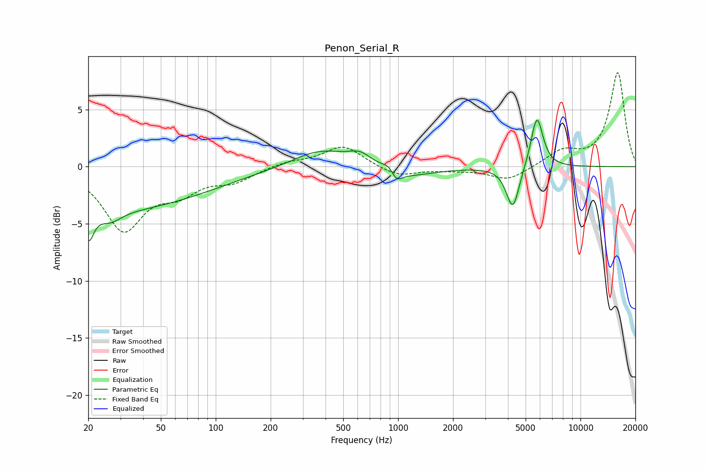

# Penon_Serial_R
See [usage instructions](https://github.com/jaakkopasanen/AutoEq#usage) for more options and info.

### Parametric EQs
Apply preamp of -4.2 dB when using parametric equalizer.

|   # | Type    |   Fc (Hz) |    Q |   Gain (dB) |
|-----|---------|-----------|------|-------------|
|   1 | Peaking |        20 | 5.41 |        -2.4 |
|   2 | Peaking |        24 | 0.24 |        -3.8 |
|   3 | Peaking |        27 | 2.5  |        -0.9 |
|   4 | Peaking |       374 | 0.93 |         1.6 |
|   5 | Peaking |       621 | 2.18 |         1   |
|   6 | Peaking |       920 | 3.67 |         1.5 |
|   7 | Peaking |       963 | 4.12 |        -1.8 |
|   8 | Peaking |      1098 | 0.93 |        -0.9 |
|   9 | Peaking |      4256 | 3.94 |        -3.8 |
|  10 | Peaking |      5768 | 4.17 |         4.6 |

### Fixed Band EQs
When using fixed band (also called graphic) equalizer, apply preamp of **-8.3 dB** (if available) and set gains manually with these parameters.

|   # | Type    |   Fc (Hz) |    Q |   Gain (dB) |
|-----|---------|-----------|------|-------------|
|   1 | Peaking |        31 | 1.41 |        -5.4 |
|   2 | Peaking |        62 | 1.41 |        -1.9 |
|   3 | Peaking |       125 | 1.41 |        -1.1 |
|   4 | Peaking |       250 | 1.41 |         0.4 |
|   5 | Peaking |       500 | 1.41 |         1.9 |
|   6 | Peaking |      1000 | 1.41 |        -0.9 |
|   7 | Peaking |      2000 | 1.41 |        -0.2 |
|   8 | Peaking |      4000 | 1.41 |        -1.2 |
|   9 | Peaking |      8000 | 1.41 |         1.3 |
|  10 | Peaking |     16000 | 1.41 |         8.2 |

### Graphs

