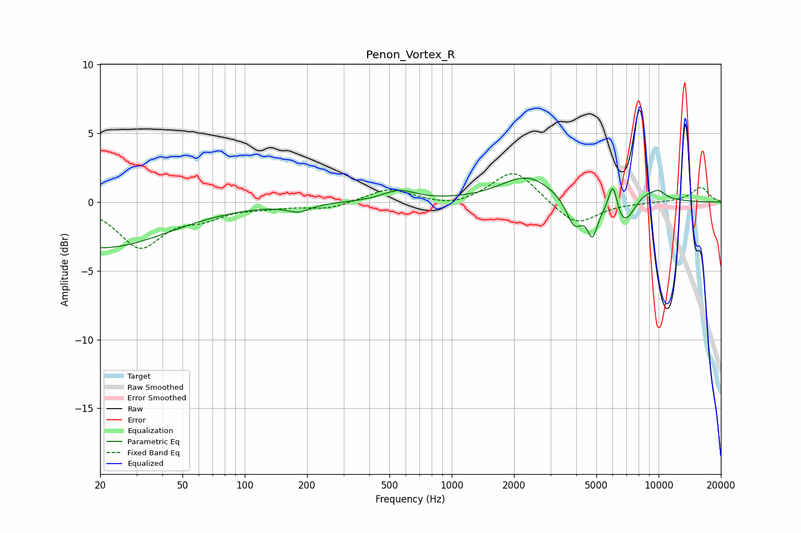

# Penon_Vortex_R
See [usage instructions](https://github.com/jaakkopasanen/AutoEq#usage) for more options and info.

### Parametric EQs
Apply preamp of -1.8 dB when using parametric equalizer.

|   # | Type    |   Fc (Hz) |    Q |   Gain (dB) |
|-----|---------|-----------|------|-------------|
|   1 | Peaking |        20 | 0.43 |        -3.3 |
|   2 | Peaking |       182 | 2.59 |        -0.6 |
|   3 | Peaking |       556 | 1.78 |         0.8 |
|   4 | Peaking |      2312 | 1.1  |         1.9 |
|   5 | Peaking |      3918 | 3.6  |        -2   |
|   6 | Peaking |      4791 | 5.74 |        -2.2 |
|   7 | Peaking |      6020 | 6    |         2.6 |
|   8 | Peaking |      6745 | 2.06 |        -2.6 |
|   9 | Peaking |      8322 | 1.46 |         1.3 |
|  10 | Peaking |     10000 | 4.28 |         0.4 |

### Fixed Band EQs
When using fixed band (also called graphic) equalizer, apply preamp of **-2.2 dB** (if available) and set gains manually with these parameters.

|   # | Type    |   Fc (Hz) |    Q |   Gain (dB) |
|-----|---------|-----------|------|-------------|
|   1 | Peaking |        31 | 1.41 |        -3.2 |
|   2 | Peaking |        62 | 1.41 |        -0.9 |
|   3 | Peaking |       125 | 1.41 |        -0.3 |
|   4 | Peaking |       250 | 1.41 |        -0.5 |
|   5 | Peaking |       500 | 1.41 |         1   |
|   6 | Peaking |      1000 | 1.41 |        -0.4 |
|   7 | Peaking |      2000 | 1.41 |         2.4 |
|   8 | Peaking |      4000 | 1.41 |        -1.8 |
|   9 | Peaking |      8000 | 1.41 |        -0   |
|  10 | Peaking |     16000 | 1.41 |         1.1 |

### Graphs

