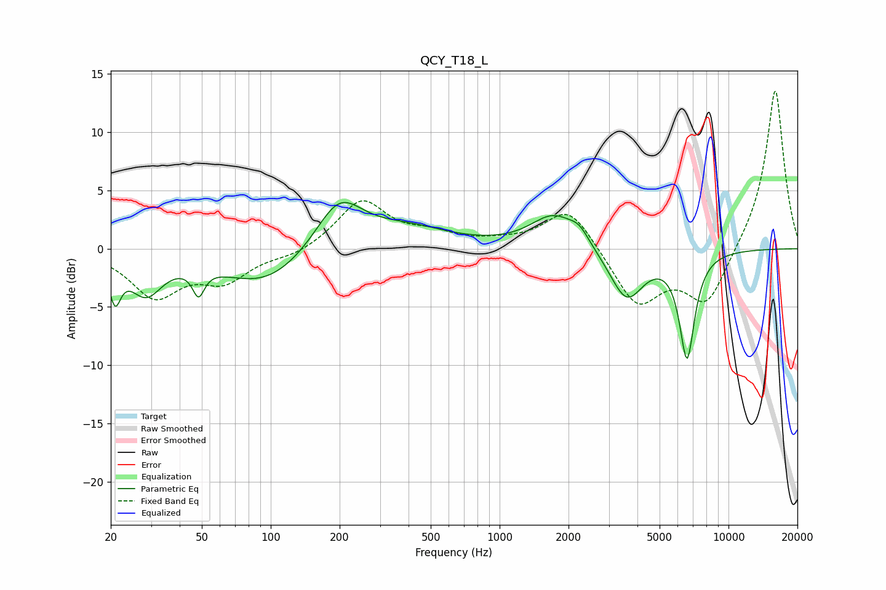

# QCY_T18_L
See [usage instructions](https://github.com/jaakkopasanen/AutoEq#usage) for more options and info.

### Parametric EQs
Apply preamp of -4.1 dB when using parametric equalizer.

|   # | Type    |   Fc (Hz) |    Q |   Gain (dB) |
|-----|---------|-----------|------|-------------|
|   1 | Peaking |        21 | 5.77 |        -3.3 |
|   2 | Peaking |        28 | 1.96 |        -3.4 |
|   3 | Peaking |        48 | 5.63 |        -2.2 |
|   4 | Peaking |        95 | 0.74 |        -3.2 |
|   5 | Peaking |       199 | 1.35 |         4.4 |
|   6 | Peaking |       394 | 0.75 |         1.6 |
|   7 | Peaking |      1727 | 1.4  |         2.9 |
|   8 | Peaking |      2229 | 3.27 |         1   |
|   9 | Peaking |      3587 | 1.89 |        -4.4 |
|  10 | Peaking |      6589 | 4.07 |        -9   |

### Fixed Band EQs
When using fixed band (also called graphic) equalizer, apply preamp of **-13.6 dB** (if available) and set gains manually with these parameters.

|   # | Type    |   Fc (Hz) |    Q |   Gain (dB) |
|-----|---------|-----------|------|-------------|
|   1 | Peaking |        31 | 1.41 |        -3.9 |
|   2 | Peaking |        62 | 1.41 |        -2.5 |
|   3 | Peaking |       125 | 1.41 |        -0.6 |
|   4 | Peaking |       250 | 1.41 |         4.1 |
|   5 | Peaking |       500 | 1.41 |         1   |
|   6 | Peaking |      1000 | 1.41 |         0.4 |
|   7 | Peaking |      2000 | 1.41 |         3.7 |
|   8 | Peaking |      4000 | 1.41 |        -4.8 |
|   9 | Peaking |      8000 | 1.41 |        -4.8 |
|  10 | Peaking |     16000 | 1.41 |        13.9 |

### Graphs

