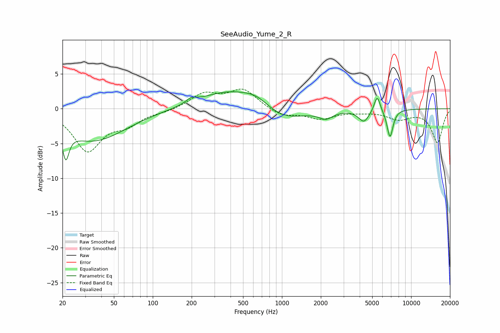

# SeeAudio_Yume_2_R
See [usage instructions](https://github.com/jaakkopasanen/AutoEq#usage) for more options and info.

### Parametric EQs
Apply preamp of -2.5 dB when using parametric equalizer.

|   # | Type    |   Fc (Hz) |    Q |   Gain (dB) |
|-----|---------|-----------|------|-------------|
|   1 | Peaking |        21 | 5.82 |        -3.9 |
|   2 | Peaking |        35 | 0.56 |        -4.6 |
|   3 | Peaking |       199 | 3.32 |         0.7 |
|   4 | Peaking |       394 | 0.63 |         2.6 |
|   5 | Peaking |       639 | 1.43 |         1.2 |
|   6 | Peaking |      1009 | 0.85 |        -2   |
|   7 | Peaking |      2186 | 2.67 |        -1.1 |
|   8 | Peaking |      4311 | 3.46 |        -1.7 |
|   9 | Peaking |      5462 | 6    |         2.4 |
|  10 | Peaking |      6865 | 5.83 |        -4   |

### Fixed Band EQs
When using fixed band (also called graphic) equalizer, apply preamp of **-2.9 dB** (if available) and set gains manually with these parameters.

|   # | Type    |   Fc (Hz) |    Q |   Gain (dB) |
|-----|---------|-----------|------|-------------|
|   1 | Peaking |        31 | 1.41 |        -5.9 |
|   2 | Peaking |        62 | 1.41 |        -1.9 |
|   3 | Peaking |       125 | 1.41 |        -0.3 |
|   4 | Peaking |       250 | 1.41 |         2.1 |
|   5 | Peaking |       500 | 1.41 |         2.7 |
|   6 | Peaking |      1000 | 1.41 |        -1.1 |
|   7 | Peaking |      2000 | 1.41 |        -1.4 |
|   8 | Peaking |      4000 | 1.41 |        -0.3 |
|   9 | Peaking |      8000 | 1.41 |        -1.3 |
|  10 | Peaking |     16000 | 1.41 |        -4.8 |

### Graphs

