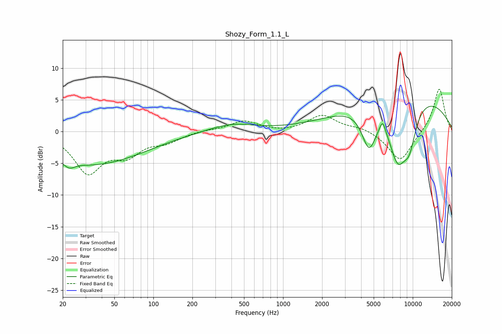

# Shozy_Form_1.1_L
See [usage instructions](https://github.com/jaakkopasanen/AutoEq#usage) for more options and info.

### Parametric EQs
Apply preamp of -4.1 dB when using parametric equalizer.

|   # | Type    |   Fc (Hz) |    Q |   Gain (dB) |
|-----|---------|-----------|------|-------------|
|   1 | Peaking |        20 | 1.35 |         1.2 |
|   2 | Peaking |        22 | 3.3  |        -1.2 |
|   3 | Peaking |        25 | 0.28 |        -3.3 |
|   4 | Peaking |        27 | 0.28 |        -2.4 |
|   5 | Peaking |       399 | 0.79 |         1.3 |
|   6 | Peaking |      4596 | 2.47 |        -6.2 |
|   7 | Peaking |      5854 | 6    |         2   |
|   8 | Peaking |      7657 | 1.74 |        -9.2 |
|   9 | Peaking |      8430 | 0.28 |         6.7 |
|  10 | Peaking |      9422 | 2.35 |        -5.2 |

### Fixed Band EQs
When using fixed band (also called graphic) equalizer, apply preamp of **-6.8 dB** (if available) and set gains manually with these parameters.

|   # | Type    |   Fc (Hz) |    Q |   Gain (dB) |
|-----|---------|-----------|------|-------------|
|   1 | Peaking |        31 | 1.41 |        -6.2 |
|   2 | Peaking |        62 | 1.41 |        -3.1 |
|   3 | Peaking |       125 | 1.41 |        -1.4 |
|   4 | Peaking |       250 | 1.41 |         0.2 |
|   5 | Peaking |       500 | 1.41 |         1.7 |
|   6 | Peaking |      1000 | 1.41 |        -0.2 |
|   7 | Peaking |      2000 | 1.41 |         2.5 |
|   8 | Peaking |      4000 | 1.41 |         0.6 |
|   9 | Peaking |      8000 | 1.41 |        -4.8 |
|  10 | Peaking |     16000 | 1.41 |         7   |

### Graphs

