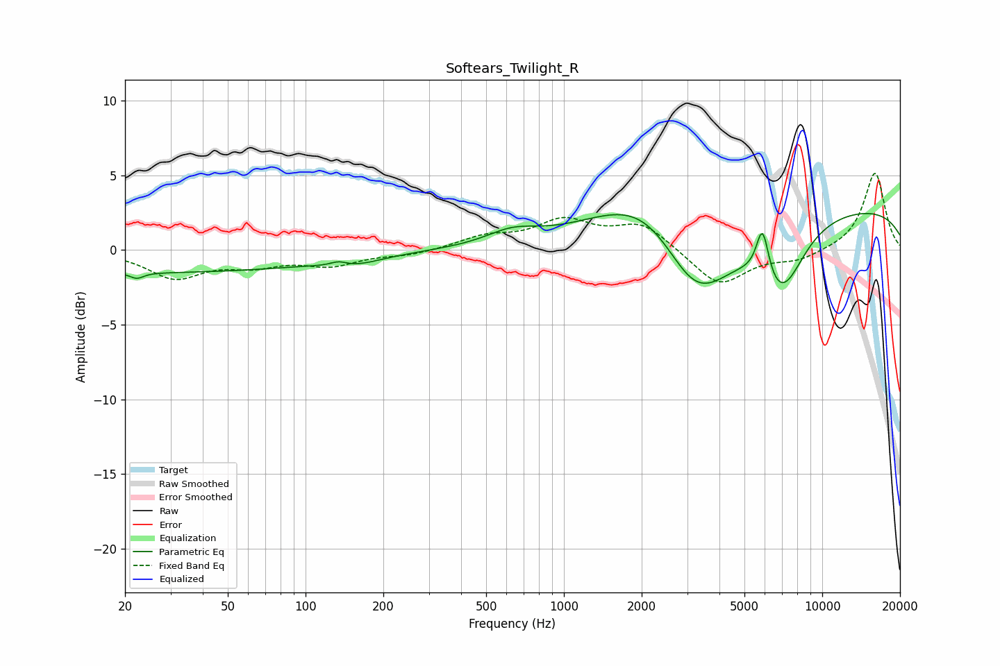

# Softears_Twilight_R
See [usage instructions](https://github.com/jaakkopasanen/AutoEq#usage) for more options and info.

### Parametric EQs
Apply preamp of -2.5 dB when using parametric equalizer.

|   # | Type    |   Fc (Hz) |    Q |   Gain (dB) |
|-----|---------|-----------|------|-------------|
|   1 | Peaking |        22 | 5.5  |        -0.4 |
|   2 | Peaking |        23 | 0.18 |        -1.5 |
|   3 | Peaking |       134 | 4.32 |         0.3 |
|   4 | Peaking |       153 | 1.41 |        -0.5 |
|   5 | Peaking |       631 | 1.4  |         0.9 |
|   6 | Peaking |      2283 | 0.66 |         5.2 |
|   7 | Peaking |      3209 | 0.88 |        -7.9 |
|   8 | Peaking |      5874 | 5.65 |         3.3 |
|   9 | Peaking |      6932 | 1.53 |        -4.5 |
|  10 | Peaking |     10000 | 0.18 |         3   |

### Fixed Band EQs
When using fixed band (also called graphic) equalizer, apply preamp of **-5.2 dB** (if available) and set gains manually with these parameters.

|   # | Type    |   Fc (Hz) |    Q |   Gain (dB) |
|-----|---------|-----------|------|-------------|
|   1 | Peaking |        31 | 1.41 |        -1.8 |
|   2 | Peaking |        62 | 1.41 |        -0.9 |
|   3 | Peaking |       125 | 1.41 |        -0.9 |
|   4 | Peaking |       250 | 1.41 |        -0.3 |
|   5 | Peaking |       500 | 1.41 |         0.8 |
|   6 | Peaking |      1000 | 1.41 |         1.8 |
|   7 | Peaking |      2000 | 1.41 |         1.7 |
|   8 | Peaking |      4000 | 1.41 |        -2.4 |
|   9 | Peaking |      8000 | 1.41 |        -0.6 |
|  10 | Peaking |     16000 | 1.41 |         5.2 |

### Graphs

