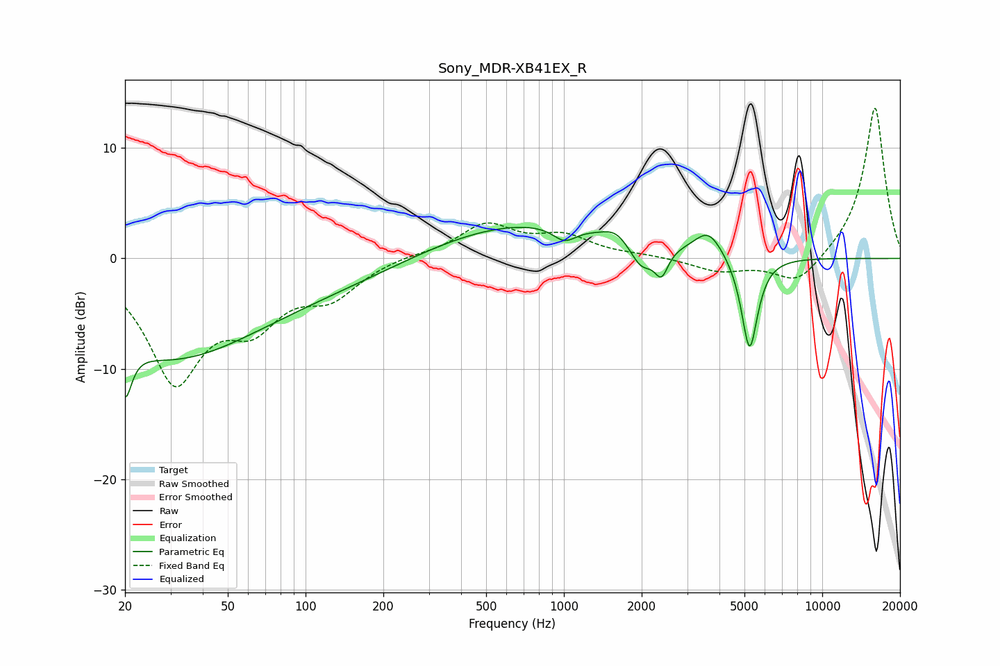

# Sony_MDR-XB41EX_R
See [usage instructions](https://github.com/jaakkopasanen/AutoEq#usage) for more options and info.

### Parametric EQs
Apply preamp of -2.9 dB when using parametric equalizer.

|   # | Type    |   Fc (Hz) |    Q |   Gain (dB) |
|-----|---------|-----------|------|-------------|
|   1 | Peaking |        20 | 5.66 |        -4.7 |
|   2 | Peaking |        28 | 0.43 |        -6.5 |
|   3 | Peaking |        62 | 0.23 |        -2.9 |
|   4 | Peaking |       680 | 0.36 |         3.5 |
|   5 | Peaking |      1006 | 3.12 |        -1.3 |
|   6 | Peaking |      1587 | 2.99 |         0.9 |
|   7 | Peaking |      1995 | 3.18 |        -2.3 |
|   8 | Peaking |      2386 | 5.4  |        -2.4 |
|   9 | Peaking |      3634 | 2.6  |         2.3 |
|  10 | Peaking |      5232 | 4.38 |        -8.7 |

### Fixed Band EQs
When using fixed band (also called graphic) equalizer, apply preamp of **-13.7 dB** (if available) and set gains manually with these parameters.

|   # | Type    |   Fc (Hz) |    Q |   Gain (dB) |
|-----|---------|-----------|------|-------------|
|   1 | Peaking |        31 | 1.41 |       -10.6 |
|   2 | Peaking |        62 | 1.41 |        -4.7 |
|   3 | Peaking |       125 | 1.41 |        -3   |
|   4 | Peaking |       250 | 1.41 |         0.3 |
|   5 | Peaking |       500 | 1.41 |         3   |
|   6 | Peaking |      1000 | 1.41 |         1.8 |
|   7 | Peaking |      2000 | 1.41 |         0.2 |
|   8 | Peaking |      4000 | 1.41 |        -1.1 |
|   9 | Peaking |      8000 | 1.41 |        -2.5 |
|  10 | Peaking |     16000 | 1.41 |        13.9 |

### Graphs

