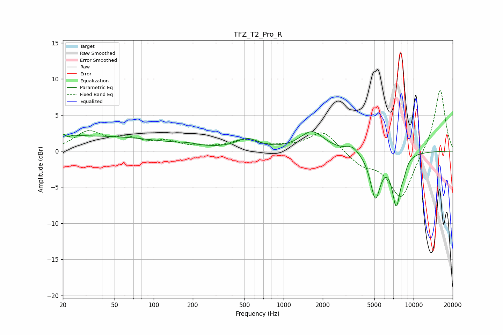

# TFZ_T2_Pro_R
See [usage instructions](https://github.com/jaakkopasanen/AutoEq#usage) for more options and info.

### Parametric EQs
Apply preamp of -2.8 dB when using parametric equalizer.

|   # | Type    |   Fc (Hz) |    Q |   Gain (dB) |
|-----|---------|-----------|------|-------------|
|   1 | Peaking |        21 | 4.4  |         1.7 |
|   2 | Peaking |        22 | 5.95 |        -1.7 |
|   3 | Peaking |        32 | 0.23 |         2.1 |
|   4 | Peaking |       180 | 1.83 |         0.3 |
|   5 | Peaking |       526 | 1.65 |         1.5 |
|   6 | Peaking |      1653 | 1.55 |         2.7 |
|   7 | Peaking |      3384 | 3.12 |         0.8 |
|   8 | Peaking |      5081 | 3.53 |        -6.2 |
|   9 | Peaking |      7362 | 4.1  |        -6.9 |
|  10 | Peaking |      8402 | 6    |        -1.1 |

### Fixed Band EQs
When using fixed band (also called graphic) equalizer, apply preamp of **-8.5 dB** (if available) and set gains manually with these parameters.

|   # | Type    |   Fc (Hz) |    Q |   Gain (dB) |
|-----|---------|-----------|------|-------------|
|   1 | Peaking |        31 | 1.41 |         2.5 |
|   2 | Peaking |        62 | 1.41 |         1.4 |
|   3 | Peaking |       125 | 1.41 |         1.1 |
|   4 | Peaking |       250 | 1.41 |         0.3 |
|   5 | Peaking |       500 | 1.41 |         1.4 |
|   6 | Peaking |      1000 | 1.41 |         0.4 |
|   7 | Peaking |      2000 | 1.41 |         2.8 |
|   8 | Peaking |      4000 | 1.41 |        -1.7 |
|   9 | Peaking |      8000 | 1.41 |        -6.6 |
|  10 | Peaking |     16000 | 1.41 |         8.8 |

### Graphs

