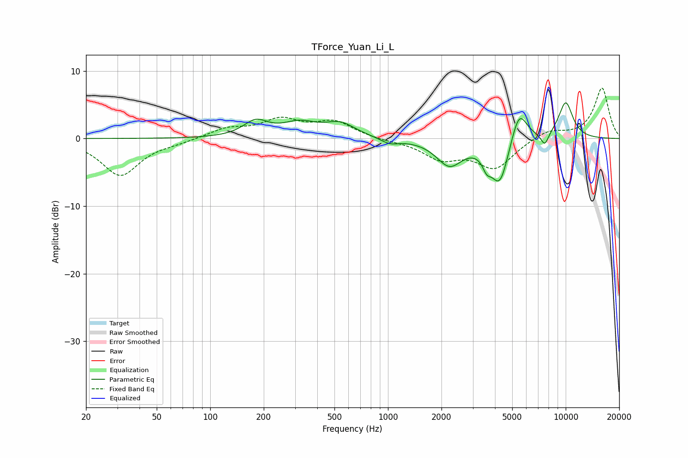

# TForce_Yuan_Li_L
See [usage instructions](https://github.com/jaakkopasanen/AutoEq#usage) for more options and info.

### Parametric EQs
Apply preamp of -5.4 dB when using parametric equalizer.

|   # | Type    |   Fc (Hz) |    Q |   Gain (dB) |
|-----|---------|-----------|------|-------------|
|   1 | Peaking |       180 | 2.05 |         2.3 |
|   2 | Peaking |       318 | 1.45 |         2   |
|   3 | Peaking |       540 | 1.65 |         2   |
|   4 | Peaking |      1023 | 2.75 |        -0.8 |
|   5 | Peaking |      2218 | 1.92 |        -3.8 |
|   6 | Peaking |      3594 | 5.96 |        -1.7 |
|   7 | Peaking |      4258 | 2.69 |        -6.9 |
|   8 | Peaking |      5455 | 2.96 |         5.1 |
|   9 | Peaking |      7627 | 5.95 |        -1.9 |
|  10 | Peaking |     10000 | 2.91 |         5.4 |

### Fixed Band EQs
When using fixed band (also called graphic) equalizer, apply preamp of **-7.6 dB** (if available) and set gains manually with these parameters.

|   # | Type    |   Fc (Hz) |    Q |   Gain (dB) |
|-----|---------|-----------|------|-------------|
|   1 | Peaking |        31 | 1.41 |        -5.4 |
|   2 | Peaking |        62 | 1.41 |        -0.4 |
|   3 | Peaking |       125 | 1.41 |         1.4 |
|   4 | Peaking |       250 | 1.41 |         2.6 |
|   5 | Peaking |       500 | 1.41 |         2.4 |
|   6 | Peaking |      1000 | 1.41 |        -0.3 |
|   7 | Peaking |      2000 | 1.41 |        -2.7 |
|   8 | Peaking |      4000 | 1.41 |        -4.2 |
|   9 | Peaking |      8000 | 1.41 |         1.3 |
|  10 | Peaking |     16000 | 1.41 |         7.5 |

### Graphs

