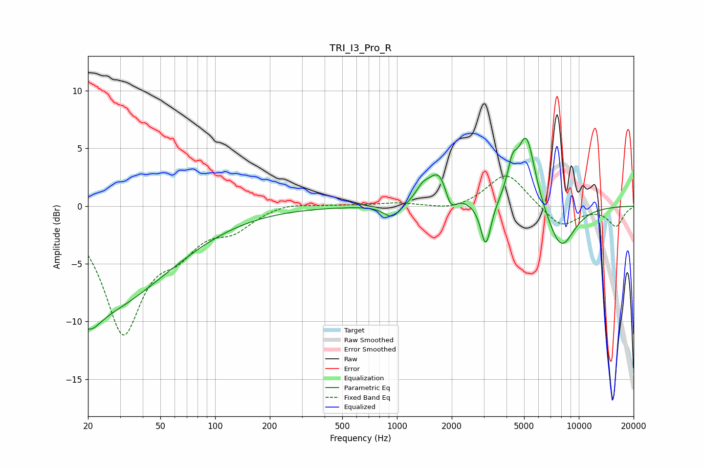

# TRI_I3_Pro_R
See [usage instructions](https://github.com/jaakkopasanen/AutoEq#usage) for more options and info.

### Parametric EQs
Apply preamp of -6.0 dB when using parametric equalizer.

|   # | Type    |   Fc (Hz) |    Q |   Gain (dB) |
|-----|---------|-----------|------|-------------|
|   1 | Peaking |        20 | 2.4  |        -1.8 |
|   2 | Peaking |        22 | 0.36 |        -8.9 |
|   3 | Peaking |       942 | 3.05 |        -1.2 |
|   4 | Peaking |      1381 | 3.92 |         0.9 |
|   5 | Peaking |      1723 | 2.31 |         3.3 |
|   6 | Peaking |      1964 | 4.37 |        -2   |
|   7 | Peaking |      3080 | 4.97 |        -3.9 |
|   8 | Peaking |      4308 | 5.14 |         2.3 |
|   9 | Peaking |      5150 | 2.82 |         6.3 |
|  10 | Peaking |      7962 | 1.73 |        -3.9 |

### Fixed Band EQs
When using fixed band (also called graphic) equalizer, apply preamp of **-2.7 dB** (if available) and set gains manually with these parameters.

|   # | Type    |   Fc (Hz) |    Q |   Gain (dB) |
|-----|---------|-----------|------|-------------|
|   1 | Peaking |        31 | 1.41 |       -10.6 |
|   2 | Peaking |        62 | 1.41 |        -2.7 |
|   3 | Peaking |       125 | 1.41 |        -1.7 |
|   4 | Peaking |       250 | 1.41 |         0.4 |
|   5 | Peaking |       500 | 1.41 |         0.1 |
|   6 | Peaking |      1000 | 1.41 |         0.3 |
|   7 | Peaking |      2000 | 1.41 |        -0.4 |
|   8 | Peaking |      4000 | 1.41 |         3   |
|   9 | Peaking |      8000 | 1.41 |        -1.9 |
|  10 | Peaking |     16000 | 1.41 |        -1.7 |

### Graphs

