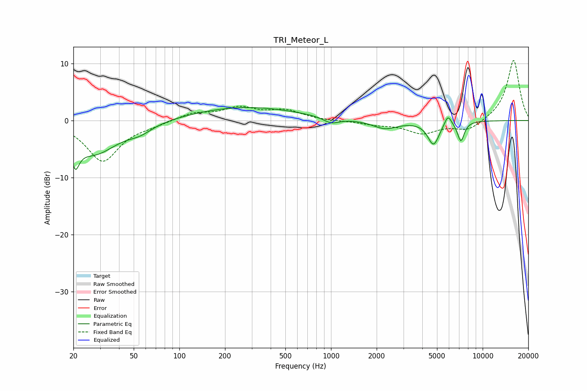

# TRI_Meteor_L
See [usage instructions](https://github.com/jaakkopasanen/AutoEq#usage) for more options and info.

### Parametric EQs
Apply preamp of -2.4 dB when using parametric equalizer.

|   # | Type    |   Fc (Hz) |    Q |   Gain (dB) |
|-----|---------|-----------|------|-------------|
|   1 | Peaking |        21 | 5.64 |        -7.4 |
|   2 | Peaking |        21 | 6    |         3.2 |
|   3 | Peaking |        27 | 0.92 |        -5.7 |
|   4 | Peaking |        55 | 1.74 |        -1.3 |
|   5 | Peaking |       271 | 0.4  |         2.4 |
|   6 | Peaking |      1004 | 2.67 |        -1.1 |
|   7 | Peaking |      2272 | 1.71 |        -1.5 |
|   8 | Peaking |      4742 | 3.69 |        -4.1 |
|   9 | Peaking |      5905 | 6    |         1.9 |
|  10 | Peaking |      7187 | 5.98 |        -3.4 |

### Fixed Band EQs
When using fixed band (also called graphic) equalizer, apply preamp of **-10.6 dB** (if available) and set gains manually with these parameters.

|   # | Type    |   Fc (Hz) |    Q |   Gain (dB) |
|-----|---------|-----------|------|-------------|
|   1 | Peaking |        31 | 1.41 |        -7.1 |
|   2 | Peaking |        62 | 1.41 |        -0.6 |
|   3 | Peaking |       125 | 1.41 |         1.3 |
|   4 | Peaking |       250 | 1.41 |         2.1 |
|   5 | Peaking |       500 | 1.41 |         1.6 |
|   6 | Peaking |      1000 | 1.41 |        -0.1 |
|   7 | Peaking |      2000 | 1.41 |        -0.6 |
|   8 | Peaking |      4000 | 1.41 |        -2.1 |
|   9 | Peaking |      8000 | 1.41 |        -1.8 |
|  10 | Peaking |     16000 | 1.41 |        10.7 |

### Graphs

