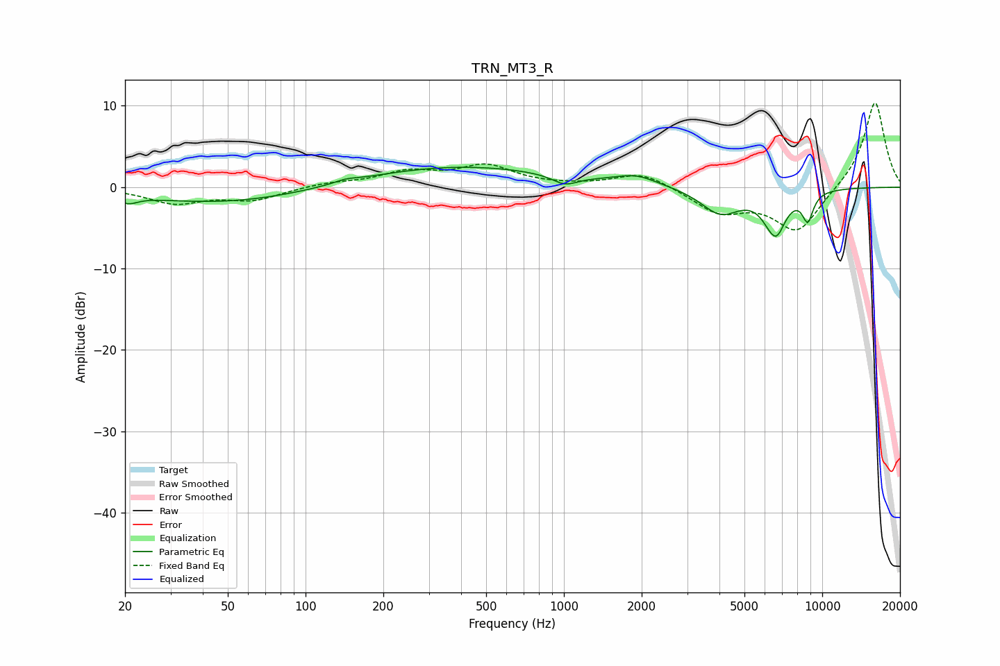

# TRN_MT3_R
See [usage instructions](https://github.com/jaakkopasanen/AutoEq#usage) for more options and info.

### Parametric EQs
Apply preamp of -2.5 dB when using parametric equalizer.

|   # | Type    |   Fc (Hz) |    Q |   Gain (dB) |
|-----|---------|-----------|------|-------------|
|   1 | Peaking |        21 | 3.89 |        -0.9 |
|   2 | Peaking |        48 | 0.43 |        -2   |
|   3 | Peaking |       143 | 3.06 |         0.4 |
|   4 | Peaking |       386 | 0.37 |         2.6 |
|   5 | Peaking |      1009 | 2.84 |        -1.2 |
|   6 | Peaking |      1903 | 1.75 |         1.2 |
|   7 | Peaking |      4036 | 1.82 |        -3.2 |
|   8 | Peaking |      6444 | 6    |         1.2 |
|   9 | Peaking |      6538 | 3.53 |        -6.4 |
|  10 | Peaking |      8787 | 6    |        -3.3 |

### Fixed Band EQs
When using fixed band (also called graphic) equalizer, apply preamp of **-10.4 dB** (if available) and set gains manually with these parameters.

|   # | Type    |   Fc (Hz) |    Q |   Gain (dB) |
|-----|---------|-----------|------|-------------|
|   1 | Peaking |        31 | 1.41 |        -1.9 |
|   2 | Peaking |        62 | 1.41 |        -1.5 |
|   3 | Peaking |       125 | 1.41 |         0.5 |
|   4 | Peaking |       250 | 1.41 |         1.7 |
|   5 | Peaking |       500 | 1.41 |         2.5 |
|   6 | Peaking |      1000 | 1.41 |         0.1 |
|   7 | Peaking |      2000 | 1.41 |         1.9 |
|   8 | Peaking |      4000 | 1.41 |        -3   |
|   9 | Peaking |      8000 | 1.41 |        -5.5 |
|  10 | Peaking |     16000 | 1.41 |        10.7 |

### Graphs

