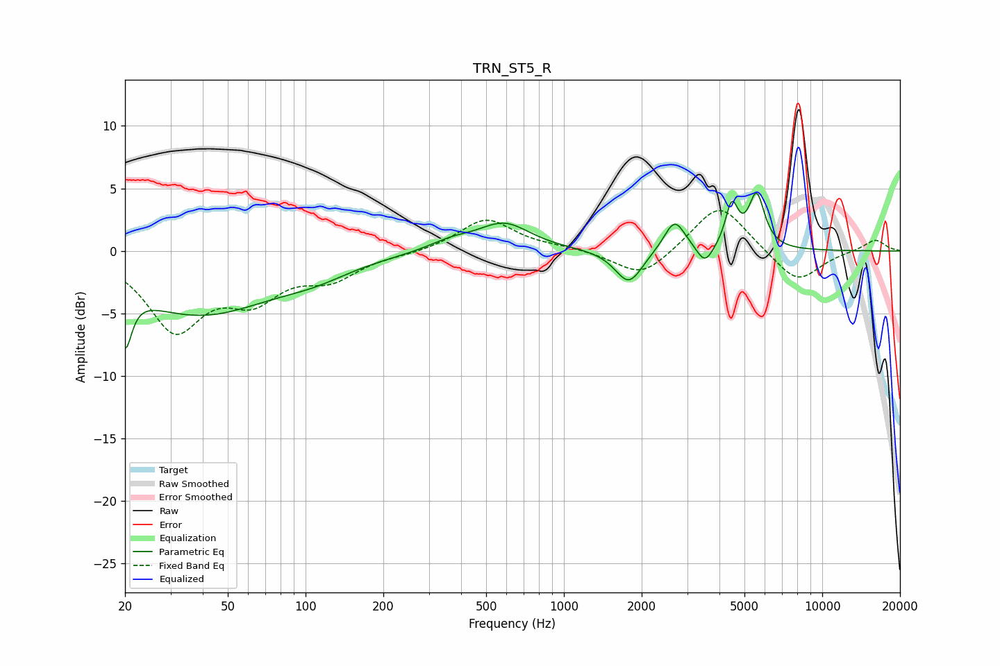

# TRN_ST5_R
See [usage instructions](https://github.com/jaakkopasanen/AutoEq#usage) for more options and info.

### Parametric EQs
Apply preamp of -4.7 dB when using parametric equalizer.

|   # | Type    |   Fc (Hz) |    Q |   Gain (dB) |
|-----|---------|-----------|------|-------------|
|   1 | Peaking |        20 | 5.66 |        -4.4 |
|   2 | Peaking |        39 | 0.49 |        -5   |
|   3 | Peaking |       109 | 1.02 |        -0.9 |
|   4 | Peaking |       366 | 1.6  |         0.7 |
|   5 | Peaking |       587 | 1.4  |         2.2 |
|   6 | Peaking |      1784 | 2.69 |        -2.7 |
|   7 | Peaking |      2683 | 3.44 |         2.6 |
|   8 | Peaking |      3518 | 4.45 |        -1.5 |
|   9 | Peaking |      4467 | 5.77 |         3.4 |
|  10 | Peaking |      5571 | 4.53 |         4.3 |

### Fixed Band EQs
When using fixed band (also called graphic) equalizer, apply preamp of **-3.3 dB** (if available) and set gains manually with these parameters.

|   # | Type    |   Fc (Hz) |    Q |   Gain (dB) |
|-----|---------|-----------|------|-------------|
|   1 | Peaking |        31 | 1.41 |        -6   |
|   2 | Peaking |        62 | 1.41 |        -3.2 |
|   3 | Peaking |       125 | 1.41 |        -1.9 |
|   4 | Peaking |       250 | 1.41 |        -0.2 |
|   5 | Peaking |       500 | 1.41 |         2.6 |
|   6 | Peaking |      1000 | 1.41 |         0.2 |
|   7 | Peaking |      2000 | 1.41 |        -2.2 |
|   8 | Peaking |      4000 | 1.41 |         4   |
|   9 | Peaking |      8000 | 1.41 |        -2.6 |
|  10 | Peaking |     16000 | 1.41 |         0.9 |

### Graphs

