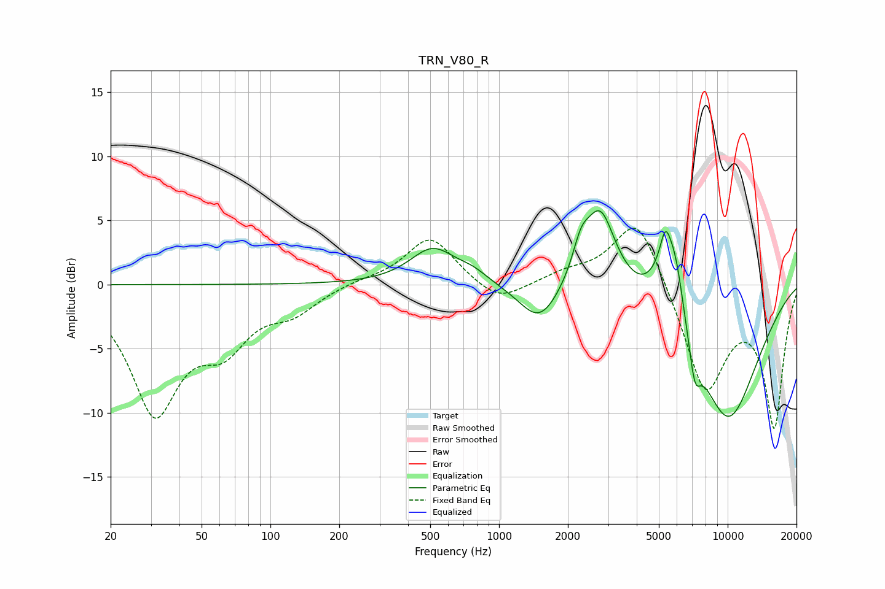

# TRN_V80_R
See [usage instructions](https://github.com/jaakkopasanen/AutoEq#usage) for more options and info.

### Parametric EQs
Apply preamp of -5.9 dB when using parametric equalizer.

|   # | Type    |   Fc (Hz) |    Q |   Gain (dB) |
|-----|---------|-----------|------|-------------|
|   1 | Peaking |       513 | 1.42 |         2.8 |
|   2 | Peaking |       767 | 2.09 |         0.7 |
|   3 | Peaking |      1504 | 1.6  |        -3.1 |
|   4 | Peaking |      2282 | 3.81 |         2.2 |
|   5 | Peaking |      2772 | 2.08 |         6.3 |
|   6 | Peaking |      5139 | 2.33 |         2.1 |
|   7 | Peaking |      5336 | 5.87 |         2.7 |
|   8 | Peaking |      5892 | 3.38 |         4.5 |
|   9 | Peaking |      7180 | 5.47 |        -2.9 |
|  10 | Peaking |     10000 | 0.8  |       -10.6 |

### Fixed Band EQs
When using fixed band (also called graphic) equalizer, apply preamp of **-4.5 dB** (if available) and set gains manually with these parameters.

|   # | Type    |   Fc (Hz) |    Q |   Gain (dB) |
|-----|---------|-----------|------|-------------|
|   1 | Peaking |        31 | 1.41 |        -9.6 |
|   2 | Peaking |        62 | 1.41 |        -3.9 |
|   3 | Peaking |       125 | 1.41 |        -1.8 |
|   4 | Peaking |       250 | 1.41 |         0.3 |
|   5 | Peaking |       500 | 1.41 |         3.8 |
|   6 | Peaking |      1000 | 1.41 |        -1.6 |
|   7 | Peaking |      2000 | 1.41 |         0.8 |
|   8 | Peaking |      4000 | 1.41 |         5.6 |
|   9 | Peaking |      8000 | 1.41 |        -8.4 |
|  10 | Peaking |     16000 | 1.41 |       -10.9 |

### Graphs

