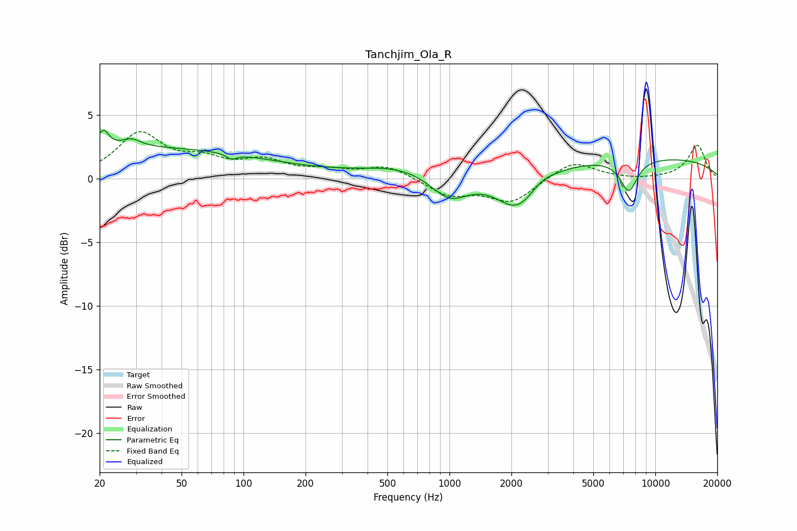

# Tanchjim_Ola_R
See [usage instructions](https://github.com/jaakkopasanen/AutoEq#usage) for more options and info.

### Parametric EQs
Apply preamp of -3.9 dB when using parametric equalizer.

|   # | Type    |   Fc (Hz) |    Q |   Gain (dB) |
|-----|---------|-----------|------|-------------|
|   1 | Peaking |        21 | 5.81 |         1.3 |
|   2 | Peaking |        28 | 0.19 |         2.4 |
|   3 | Peaking |        29 | 3.26 |         0.6 |
|   4 | Peaking |        88 | 5.56 |        -0.4 |
|   5 | Peaking |       582 | 0.73 |         0.9 |
|   6 | Peaking |      1003 | 1.5  |        -2.1 |
|   7 | Peaking |      2143 | 1.35 |        -3.2 |
|   8 | Peaking |      2784 | 2.44 |         0.6 |
|   9 | Peaking |      7433 | 3.21 |        -2.5 |
|  10 | Peaking |      7705 | 0.19 |         1.7 |

### Fixed Band EQs
When using fixed band (also called graphic) equalizer, apply preamp of **-3.8 dB** (if available) and set gains manually with these parameters.

|   # | Type    |   Fc (Hz) |    Q |   Gain (dB) |
|-----|---------|-----------|------|-------------|
|   1 | Peaking |        31 | 1.41 |         3.4 |
|   2 | Peaking |        62 | 1.41 |         1.2 |
|   3 | Peaking |       125 | 1.41 |         1.2 |
|   4 | Peaking |       250 | 1.41 |         0.5 |
|   5 | Peaking |       500 | 1.41 |         1   |
|   6 | Peaking |      1000 | 1.41 |        -1.3 |
|   7 | Peaking |      2000 | 1.41 |        -1.8 |
|   8 | Peaking |      4000 | 1.41 |         1.4 |
|   9 | Peaking |      8000 | 1.41 |        -0.1 |
|  10 | Peaking |     16000 | 1.41 |         2.6 |

### Graphs

