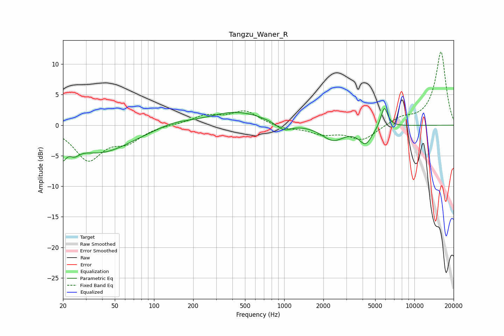

# Tangzu_Waner_R
See [usage instructions](https://github.com/jaakkopasanen/AutoEq#usage) for more options and info.

### Parametric EQs
Apply preamp of -2.8 dB when using parametric equalizer.

|   # | Type    |   Fc (Hz) |    Q |   Gain (dB) |
|-----|---------|-----------|------|-------------|
|   1 | Peaking |        20 | 5.35 |        -5.1 |
|   2 | Peaking |        20 | 5.98 |         2.3 |
|   3 | Peaking |        24 | 3.75 |        -1.3 |
|   4 | Peaking |        38 | 0.59 |        -4.4 |
|   5 | Peaking |       142 | 1.13 |         0.7 |
|   6 | Peaking |       430 | 0.66 |         2.2 |
|   7 | Peaking |       993 | 2.36 |        -1.4 |
|   8 | Peaking |      2372 | 1.6  |        -2.4 |
|   9 | Peaking |      4218 | 2.75 |        -2.8 |
|  10 | Peaking |      5873 | 5.11 |         3.4 |

### Fixed Band EQs
When using fixed band (also called graphic) equalizer, apply preamp of **-12.1 dB** (if available) and set gains manually with these parameters.

|   # | Type    |   Fc (Hz) |    Q |   Gain (dB) |
|-----|---------|-----------|------|-------------|
|   1 | Peaking |        31 | 1.41 |        -5.5 |
|   2 | Peaking |        62 | 1.41 |        -2.3 |
|   3 | Peaking |       125 | 1.41 |         0.1 |
|   4 | Peaking |       250 | 1.41 |         1.5 |
|   5 | Peaking |       500 | 1.41 |         2.2 |
|   6 | Peaking |      1000 | 1.41 |        -0.6 |
|   7 | Peaking |      2000 | 1.41 |        -1.3 |
|   8 | Peaking |      4000 | 1.41 |        -2.4 |
|   9 | Peaking |      8000 | 1.41 |         1.1 |
|  10 | Peaking |     16000 | 1.41 |        12   |

### Graphs

