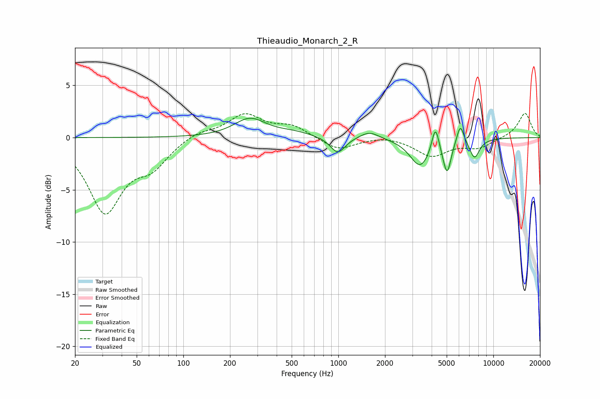

# Thieaudio_Monarch_2_R
See [usage instructions](https://github.com/jaakkopasanen/AutoEq#usage) for more options and info.

### Parametric EQs
Apply preamp of -2.0 dB when using parametric equalizer.

|   # | Type    |   Fc (Hz) |    Q |   Gain (dB) |
|-----|---------|-----------|------|-------------|
|   1 | Peaking |       269 | 1.39 |         1.8 |
|   2 | Peaking |       512 | 1.2  |         0.4 |
|   3 | Peaking |       991 | 2.95 |        -1.6 |
|   4 | Peaking |      1588 | 2.32 |         0.7 |
|   5 | Peaking |      3378 | 2.16 |        -2.7 |
|   6 | Peaking |      4232 | 6    |         2.5 |
|   7 | Peaking |      4905 | 4.24 |        -1   |
|   8 | Peaking |      5054 | 5.99 |        -2.3 |
|   9 | Peaking |      6125 | 6    |         1.9 |
|  10 | Peaking |      7564 | 4.14 |        -1.8 |

### Fixed Band EQs
When using fixed band (also called graphic) equalizer, apply preamp of **-2.4 dB** (if available) and set gains manually with these parameters.

|   # | Type    |   Fc (Hz) |    Q |   Gain (dB) |
|-----|---------|-----------|------|-------------|
|   1 | Peaking |        31 | 1.41 |        -6.9 |
|   2 | Peaking |        62 | 1.41 |        -2.3 |
|   3 | Peaking |       125 | 1.41 |         0.6 |
|   4 | Peaking |       250 | 1.41 |         2.2 |
|   5 | Peaking |       500 | 1.41 |         1.1 |
|   6 | Peaking |      1000 | 1.41 |        -1.2 |
|   7 | Peaking |      2000 | 1.41 |         0.2 |
|   8 | Peaking |      4000 | 1.41 |        -1.7 |
|   9 | Peaking |      8000 | 1.41 |        -0.9 |
|  10 | Peaking |     16000 | 1.41 |         2.4 |

### Graphs

