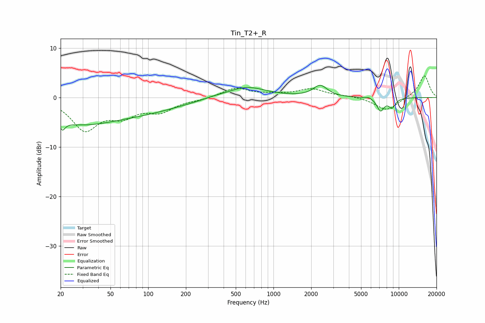

# Tin_T2+_R
See [usage instructions](https://github.com/jaakkopasanen/AutoEq#usage) for more options and info.

### Parametric EQs
Apply preamp of -2.6 dB when using parametric equalizer.

|   # | Type    |   Fc (Hz) |    Q |   Gain (dB) |
|-----|---------|-----------|------|-------------|
|   1 | Peaking |        21 | 5.78 |         3   |
|   2 | Peaking |        21 | 5.98 |        -4.8 |
|   3 | Peaking |        28 | 0.47 |        -4.9 |
|   4 | Peaking |       102 | 0.48 |        -2.1 |
|   5 | Peaking |       326 | 2.04 |         0.2 |
|   6 | Peaking |       605 | 0.92 |         2.2 |
|   7 | Peaking |      2359 | 2.52 |         2.3 |
|   8 | Peaking |      5794 | 5.95 |         0.3 |
|   9 | Peaking |      7154 | 4.62 |        -2.6 |
|  10 | Peaking |      8833 | 4.58 |        -1.9 |

### Fixed Band EQs
When using fixed band (also called graphic) equalizer, apply preamp of **-4.4 dB** (if available) and set gains manually with these parameters.

|   # | Type    |   Fc (Hz) |    Q |   Gain (dB) |
|-----|---------|-----------|------|-------------|
|   1 | Peaking |        31 | 1.41 |        -6.3 |
|   2 | Peaking |        62 | 1.41 |        -3.1 |
|   3 | Peaking |       125 | 1.41 |        -2.5 |
|   4 | Peaking |       250 | 1.41 |        -0.4 |
|   5 | Peaking |       500 | 1.41 |         1.9 |
|   6 | Peaking |      1000 | 1.41 |         0.5 |
|   7 | Peaking |      2000 | 1.41 |         1.7 |
|   8 | Peaking |      4000 | 1.41 |         0.3 |
|   9 | Peaking |      8000 | 1.41 |        -2.7 |
|  10 | Peaking |     16000 | 1.41 |         4.5 |

### Graphs

