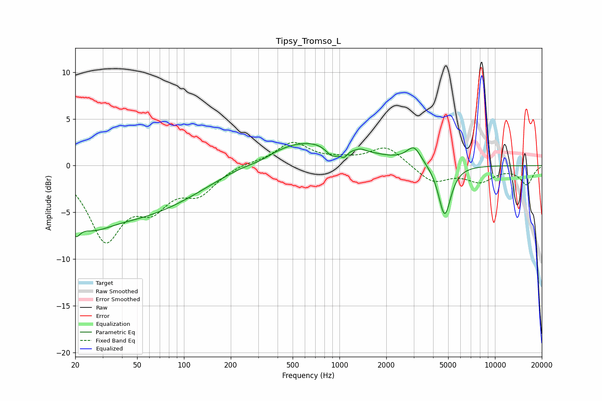

# Tipsy_Tromso_L
See [usage instructions](https://github.com/jaakkopasanen/AutoEq#usage) for more options and info.

### Parametric EQs
Apply preamp of -2.5 dB when using parametric equalizer.

|   # | Type    |   Fc (Hz) |    Q |   Gain (dB) |
|-----|---------|-----------|------|-------------|
|   1 | Peaking |        20 | 4.7  |        -2   |
|   2 | Peaking |        25 | 1.22 |        -2   |
|   3 | Peaking |        44 | 0.32 |        -5.4 |
|   4 | Peaking |       309 | 1.62 |        -0.5 |
|   5 | Peaking |       621 | 0.43 |         2.9 |
|   6 | Peaking |       900 | 3.27 |        -1.3 |
|   7 | Peaking |      1070 | 5.82 |        -0.8 |
|   8 | Peaking |      1374 | 5.58 |         0.2 |
|   9 | Peaking |      3012 | 3.06 |         1.8 |
|  10 | Peaking |      4749 | 3.5  |        -5.5 |

### Fixed Band EQs
When using fixed band (also called graphic) equalizer, apply preamp of **-2.6 dB** (if available) and set gains manually with these parameters.

|   # | Type    |   Fc (Hz) |    Q |   Gain (dB) |
|-----|---------|-----------|------|-------------|
|   1 | Peaking |        31 | 1.41 |        -7.5 |
|   2 | Peaking |        62 | 1.41 |        -3.6 |
|   3 | Peaking |       125 | 1.41 |        -2.6 |
|   4 | Peaking |       250 | 1.41 |         0.3 |
|   5 | Peaking |       500 | 1.41 |         2.4 |
|   6 | Peaking |      1000 | 1.41 |         0.5 |
|   7 | Peaking |      2000 | 1.41 |         2.1 |
|   8 | Peaking |      4000 | 1.41 |        -1.8 |
|   9 | Peaking |      8000 | 1.41 |        -1.6 |
|  10 | Peaking |     16000 | 1.41 |        -2   |

### Graphs

