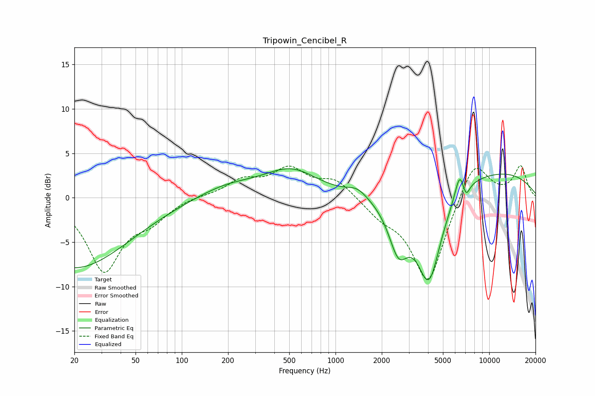

# Tripowin_Cencibel_R
See [usage instructions](https://github.com/jaakkopasanen/AutoEq#usage) for more options and info.

### Parametric EQs
Apply preamp of -3.4 dB when using parametric equalizer.

|   # | Type    |   Fc (Hz) |    Q |   Gain (dB) |
|-----|---------|-----------|------|-------------|
|   1 | Peaking |        20 | 0.4  |        -7.9 |
|   2 | Peaking |       189 | 2.78 |         0   |
|   3 | Peaking |       199 | 0.69 |         1.4 |
|   4 | Peaking |       516 | 0.81 |         2.9 |
|   5 | Peaking |      1388 | 2.13 |         1   |
|   6 | Peaking |      2567 | 2.19 |        -5.3 |
|   7 | Peaking |      4053 | 1.7  |       -10.4 |
|   8 | Peaking |      6429 | 4.49 |         2.8 |
|   9 | Peaking |      7054 | 5.72 |        -1.6 |
|  10 | Peaking |     10000 | 0.3  |         3.1 |

### Fixed Band EQs
When using fixed band (also called graphic) equalizer, apply preamp of **-3.7 dB** (if available) and set gains manually with these parameters.

|   # | Type    |   Fc (Hz) |    Q |   Gain (dB) |
|-----|---------|-----------|------|-------------|
|   1 | Peaking |        31 | 1.41 |        -8.1 |
|   2 | Peaking |        62 | 1.41 |        -2   |
|   3 | Peaking |       125 | 1.41 |         0.2 |
|   4 | Peaking |       250 | 1.41 |         1.8 |
|   5 | Peaking |       500 | 1.41 |         3   |
|   6 | Peaking |      1000 | 1.41 |         2   |
|   7 | Peaking |      2000 | 1.41 |        -1.6 |
|   8 | Peaking |      4000 | 1.41 |        -9.7 |
|   9 | Peaking |      8000 | 1.41 |         4.6 |
|  10 | Peaking |     16000 | 1.41 |         3.5 |

### Graphs

