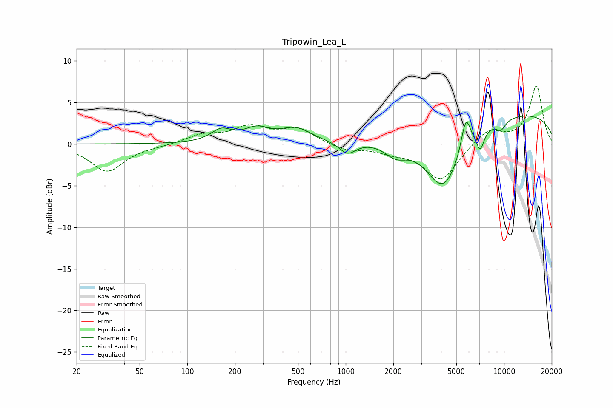

# Tripowin_Lea_L
See [usage instructions](https://github.com/jaakkopasanen/AutoEq#usage) for more options and info.

### Parametric EQs
Apply preamp of -3.5 dB when using parametric equalizer.

|   # | Type    |   Fc (Hz) |    Q |   Gain (dB) |
|-----|---------|-----------|------|-------------|
|   1 | Peaking |       164 | 2.22 |         1.4 |
|   2 | Peaking |       275 | 1.69 |         1.6 |
|   3 | Peaking |       487 | 1.5  |         1.6 |
|   4 | Peaking |      1028 | 2.69 |        -1.5 |
|   5 | Peaking |      2074 | 1.93 |        -1.8 |
|   6 | Peaking |      4152 | 1.15 |        -8   |
|   7 | Peaking |      5738 | 4.61 |         4   |
|   8 | Peaking |      7073 | 5.68 |        -2.2 |
|   9 | Peaking |      9555 | 4.08 |        -1.1 |
|  10 | Peaking |      9792 | 0.19 |         3.9 |

### Fixed Band EQs
When using fixed band (also called graphic) equalizer, apply preamp of **-7.1 dB** (if available) and set gains manually with these parameters.

|   # | Type    |   Fc (Hz) |    Q |   Gain (dB) |
|-----|---------|-----------|------|-------------|
|   1 | Peaking |        31 | 1.41 |        -3.3 |
|   2 | Peaking |        62 | 1.41 |        -0.2 |
|   3 | Peaking |       125 | 1.41 |         1   |
|   4 | Peaking |       250 | 1.41 |         1.9 |
|   5 | Peaking |       500 | 1.41 |         1.7 |
|   6 | Peaking |      1000 | 1.41 |        -0.8 |
|   7 | Peaking |      2000 | 1.41 |        -0.7 |
|   8 | Peaking |      4000 | 1.41 |        -4.4 |
|   9 | Peaking |      8000 | 1.41 |         1.8 |
|  10 | Peaking |     16000 | 1.41 |         7   |

### Graphs

