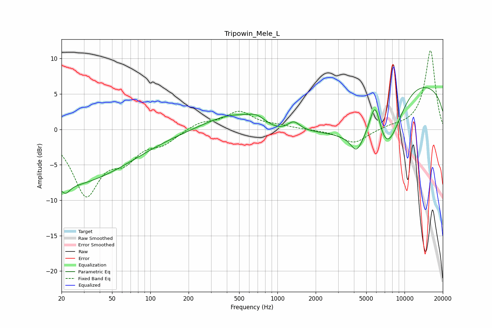

# Tripowin_Mele_L
See [usage instructions](https://github.com/jaakkopasanen/AutoEq#usage) for more options and info.

### Parametric EQs
Apply preamp of -6.0 dB when using parametric equalizer.

|   # | Type    |   Fc (Hz) |    Q |   Gain (dB) |
|-----|---------|-----------|------|-------------|
|   1 | Peaking |        20 | 0.26 |        -7.9 |
|   2 | Peaking |        22 | 4.47 |        -1.2 |
|   3 | Peaking |       450 | 0.66 |         2.3 |
|   4 | Peaking |       690 | 2.08 |         1   |
|   5 | Peaking |      1028 | 0.93 |        -1   |
|   6 | Peaking |      1344 | 2.92 |         1.4 |
|   7 | Peaking |      4184 | 3.15 |        -2.1 |
|   8 | Peaking |      5876 | 2.67 |         7.2 |
|   9 | Peaking |      7053 | 0.51 |       -20   |
|  10 | Peaking |      9713 | 0.3  |        17.5 |

### Fixed Band EQs
When using fixed band (also called graphic) equalizer, apply preamp of **-11.2 dB** (if available) and set gains manually with these parameters.

|   # | Type    |   Fc (Hz) |    Q |   Gain (dB) |
|-----|---------|-----------|------|-------------|
|   1 | Peaking |        31 | 1.41 |        -8.9 |
|   2 | Peaking |        62 | 1.41 |        -3.3 |
|   3 | Peaking |       125 | 1.41 |        -1.7 |
|   4 | Peaking |       250 | 1.41 |         1   |
|   5 | Peaking |       500 | 1.41 |         2.4 |
|   6 | Peaking |      1000 | 1.41 |         0.4 |
|   7 | Peaking |      2000 | 1.41 |        -0.1 |
|   8 | Peaking |      4000 | 1.41 |        -2   |
|   9 | Peaking |      8000 | 1.41 |         0.4 |
|  10 | Peaking |     16000 | 1.41 |        11.2 |

### Graphs

