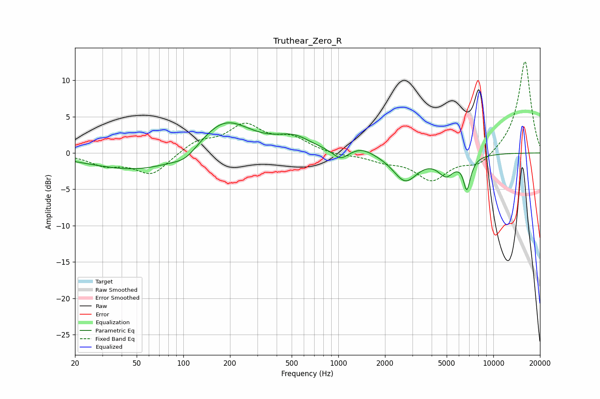

# Truthear_Zero_R
See [usage instructions](https://github.com/jaakkopasanen/AutoEq#usage) for more options and info.

### Parametric EQs
Apply preamp of -4.2 dB when using parametric equalizer.

|   # | Type    |   Fc (Hz) |    Q |   Gain (dB) |
|-----|---------|-----------|------|-------------|
|   1 | Peaking |        57 | 0.42 |        -2.7 |
|   2 | Peaking |       103 | 1.92 |        -1.1 |
|   3 | Peaking |       183 | 0.83 |         5.2 |
|   4 | Peaking |       516 | 1.27 |         1.8 |
|   5 | Peaking |      1033 | 2.85 |        -1.4 |
|   6 | Peaking |      1410 | 1.86 |         0.9 |
|   7 | Peaking |      2705 | 1.79 |        -3.8 |
|   8 | Peaking |      4954 | 2.69 |        -2.5 |
|   9 | Peaking |      6479 | 6    |         1.4 |
|  10 | Peaking |      6697 | 5.25 |        -5.4 |

### Fixed Band EQs
When using fixed band (also called graphic) equalizer, apply preamp of **-12.7 dB** (if available) and set gains manually with these parameters.

|   # | Type    |   Fc (Hz) |    Q |   Gain (dB) |
|-----|---------|-----------|------|-------------|
|   1 | Peaking |        31 | 1.41 |        -1.5 |
|   2 | Peaking |        62 | 1.41 |        -3   |
|   3 | Peaking |       125 | 1.41 |         1.6 |
|   4 | Peaking |       250 | 1.41 |         3.6 |
|   5 | Peaking |       500 | 1.41 |         1.9 |
|   6 | Peaking |      1000 | 1.41 |        -0.3 |
|   7 | Peaking |      2000 | 1.41 |        -1   |
|   8 | Peaking |      4000 | 1.41 |        -3.6 |
|   9 | Peaking |      8000 | 1.41 |        -1.8 |
|  10 | Peaking |     16000 | 1.41 |        12.8 |

### Graphs

