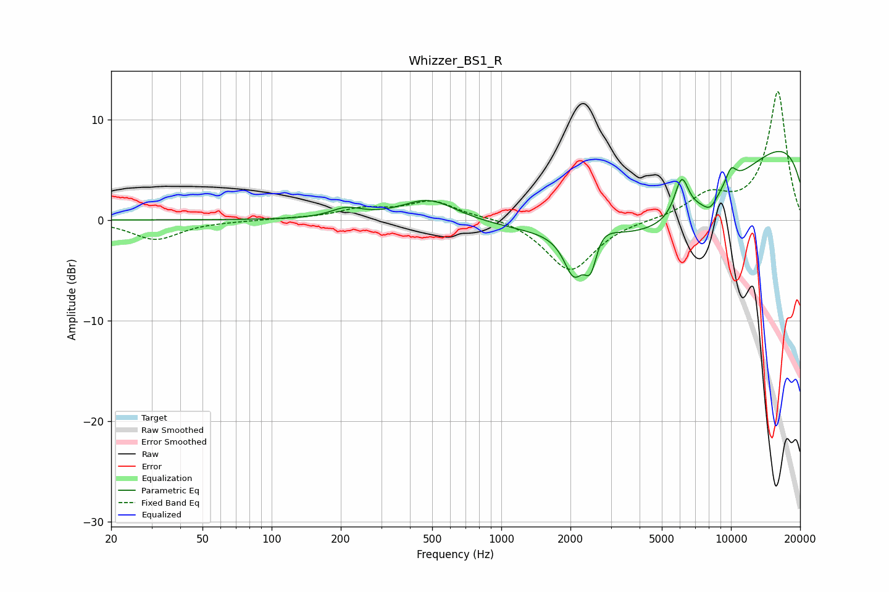

# Whizzer_BS1_R
See [usage instructions](https://github.com/jaakkopasanen/AutoEq#usage) for more options and info.

### Parametric EQs
Apply preamp of -6.9 dB when using parametric equalizer.

|   # | Type    |   Fc (Hz) |    Q |   Gain (dB) |
|-----|---------|-----------|------|-------------|
|   1 | Peaking |       211 | 2.12 |         0.9 |
|   2 | Peaking |       485 | 1.18 |         2.2 |
|   3 | Peaking |      2073 | 3.23 |        -4.5 |
|   4 | Peaking |      2453 | 4.65 |        -4.8 |
|   5 | Peaking |      2525 | 2.37 |         3   |
|   6 | Peaking |      5141 | 0.31 |       -10.7 |
|   7 | Peaking |      6099 | 4.37 |         3.9 |
|   8 | Peaking |      8116 | 3.95 |        -1.2 |
|   9 | Peaking |     10000 | 5.03 |         1.6 |
|  10 | Peaking |     10000 | 0.18 |        11.5 |

### Fixed Band EQs
When using fixed band (also called graphic) equalizer, apply preamp of **-12.9 dB** (if available) and set gains manually with these parameters.

|   # | Type    |   Fc (Hz) |    Q |   Gain (dB) |
|-----|---------|-----------|------|-------------|
|   1 | Peaking |        31 | 1.41 |        -1.9 |
|   2 | Peaking |        62 | 1.41 |        -0.1 |
|   3 | Peaking |       125 | 1.41 |         0.1 |
|   4 | Peaking |       250 | 1.41 |         1   |
|   5 | Peaking |       500 | 1.41 |         1.8 |
|   6 | Peaking |      1000 | 1.41 |         0.3 |
|   7 | Peaking |      2000 | 1.41 |        -5.1 |
|   8 | Peaking |      4000 | 1.41 |         0   |
|   9 | Peaking |      8000 | 1.41 |         2.2 |
|  10 | Peaking |     16000 | 1.41 |        12.8 |

### Graphs

