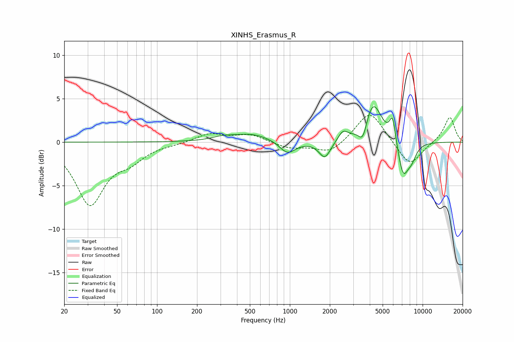

# XINHS_Erasmus_R
See [usage instructions](https://github.com/jaakkopasanen/AutoEq#usage) for more options and info.

### Parametric EQs
Apply preamp of -4.2 dB when using parametric equalizer.

|   # | Type    |   Fc (Hz) |    Q |   Gain (dB) |
|-----|---------|-----------|------|-------------|
|   1 | Peaking |       309 | 1.88 |         0.3 |
|   2 | Peaking |       513 | 0.97 |         0.9 |
|   3 | Peaking |       960 | 2.36 |        -1.5 |
|   4 | Peaking |      1834 | 3.19 |        -2   |
|   5 | Peaking |      2513 | 3.84 |         1.1 |
|   6 | Peaking |      3552 | 4.36 |        -2.2 |
|   7 | Peaking |      4223 | 2.09 |         4.8 |
|   8 | Peaking |      5941 | 6    |         2.9 |
|   9 | Peaking |      7133 | 3.34 |        -3.9 |
|  10 | Peaking |      8248 | 3.52 |        -1.5 |

### Fixed Band EQs
When using fixed band (also called graphic) equalizer, apply preamp of **-3.2 dB** (if available) and set gains manually with these parameters.

|   # | Type    |   Fc (Hz) |    Q |   Gain (dB) |
|-----|---------|-----------|------|-------------|
|   1 | Peaking |        31 | 1.41 |        -7   |
|   2 | Peaking |        62 | 1.41 |        -1.6 |
|   3 | Peaking |       125 | 1.41 |        -0.2 |
|   4 | Peaking |       250 | 1.41 |         1   |
|   5 | Peaking |       500 | 1.41 |         0.9 |
|   6 | Peaking |      1000 | 1.41 |        -0.7 |
|   7 | Peaking |      2000 | 1.41 |        -1.3 |
|   8 | Peaking |      4000 | 1.41 |         3.7 |
|   9 | Peaking |      8000 | 1.41 |        -2.9 |
|  10 | Peaking |     16000 | 1.41 |         2.9 |

### Graphs

