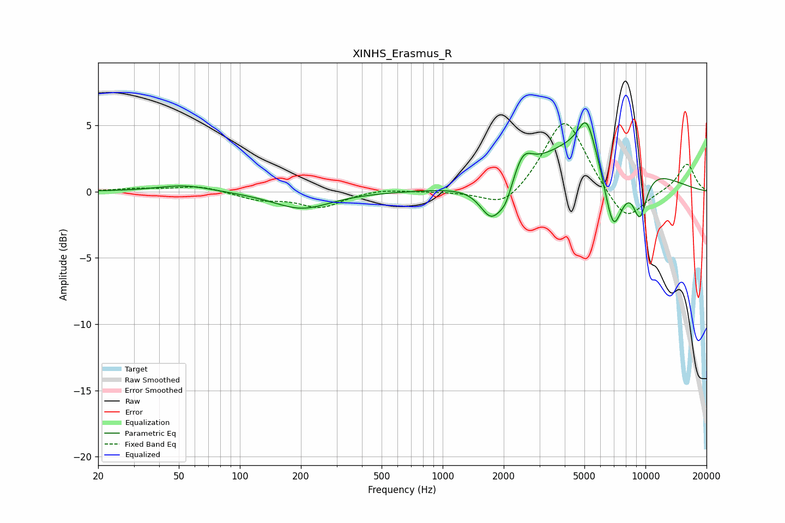

# XINHS_Erasmus_R
See [usage instructions](https://github.com/jaakkopasanen/AutoEq#usage) for more options and info.

### Parametric EQs
Apply preamp of -5.3 dB when using parametric equalizer.

|   # | Type    |   Fc (Hz) |    Q |   Gain (dB) |
|-----|---------|-----------|------|-------------|
|   1 | Peaking |        53 | 1.08 |         0.5 |
|   2 | Peaking |       202 | 0.99 |        -1.3 |
|   3 | Peaking |      1744 | 2.44 |        -2.8 |
|   4 | Peaking |      2049 | 4.25 |        -1.2 |
|   5 | Peaking |      2490 | 3.16 |         1.6 |
|   6 | Peaking |      5125 | 3.49 |         2.5 |
|   7 | Peaking |      5693 | 0.53 |         4.4 |
|   8 | Peaking |      6986 | 2.52 |        -6.5 |
|   9 | Peaking |      7373 | 5.75 |         0.3 |
|  10 | Peaking |      9380 | 3.42 |        -3.6 |

### Fixed Band EQs
When using fixed band (also called graphic) equalizer, apply preamp of **-5.2 dB** (if available) and set gains manually with these parameters.

|   # | Type    |   Fc (Hz) |    Q |   Gain (dB) |
|-----|---------|-----------|------|-------------|
|   1 | Peaking |        31 | 1.41 |         0.2 |
|   2 | Peaking |        62 | 1.41 |         0.4 |
|   3 | Peaking |       125 | 1.41 |        -0.6 |
|   4 | Peaking |       250 | 1.41 |        -1.2 |
|   5 | Peaking |       500 | 1.41 |         0.2 |
|   6 | Peaking |      1000 | 1.41 |        -0   |
|   7 | Peaking |      2000 | 1.41 |        -1.4 |
|   8 | Peaking |      4000 | 1.41 |         5.7 |
|   9 | Peaking |      8000 | 1.41 |        -2.5 |
|  10 | Peaking |     16000 | 1.41 |         2.1 |

### Graphs

