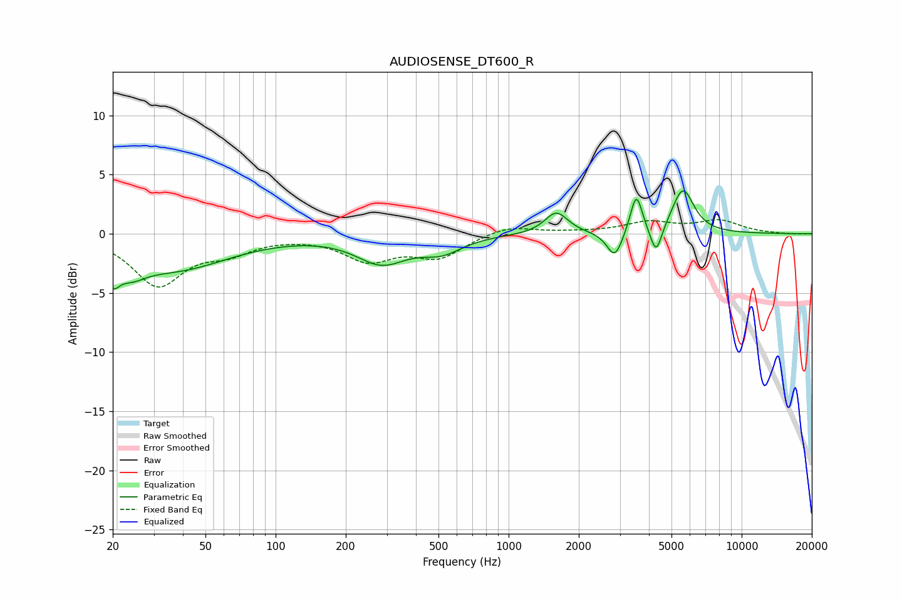

# AUDIOSENSE_DT600_R
See [usage instructions](https://github.com/jaakkopasanen/AutoEq#usage) for more options and info.

### Parametric EQs
Apply preamp of -3.7 dB when using parametric equalizer.

|   # | Type    |   Fc (Hz) |    Q |   Gain (dB) |
|-----|---------|-----------|------|-------------|
|   1 | Peaking |        20 | 5.12 |        -1.9 |
|   2 | Peaking |        24 | 2.13 |        -1.5 |
|   3 | Peaking |        37 | 0.61 |        -2.9 |
|   4 | Peaking |       285 | 1.3  |        -2.3 |
|   5 | Peaking |       517 | 1.62 |        -1.3 |
|   6 | Peaking |      1602 | 2.87 |         1.9 |
|   7 | Peaking |      2855 | 4.26 |        -2.3 |
|   8 | Peaking |      3531 | 5.59 |         3.4 |
|   9 | Peaking |      4296 | 5.68 |        -2.5 |
|  10 | Peaking |      5598 | 2.98 |         3.8 |

### Fixed Band EQs
When using fixed band (also called graphic) equalizer, apply preamp of **-1.3 dB** (if available) and set gains manually with these parameters.

|   # | Type    |   Fc (Hz) |    Q |   Gain (dB) |
|-----|---------|-----------|------|-------------|
|   1 | Peaking |        31 | 1.41 |        -4.2 |
|   2 | Peaking |        62 | 1.41 |        -1.3 |
|   3 | Peaking |       125 | 1.41 |        -0.1 |
|   4 | Peaking |       250 | 1.41 |        -2.1 |
|   5 | Peaking |       500 | 1.41 |        -1.9 |
|   6 | Peaking |      1000 | 1.41 |         0.7 |
|   7 | Peaking |      2000 | 1.41 |         0.1 |
|   8 | Peaking |      4000 | 1.41 |         0.9 |
|   9 | Peaking |      8000 | 1.41 |         1.1 |
|  10 | Peaking |     16000 | 1.41 |        -0.1 |

### Graphs

