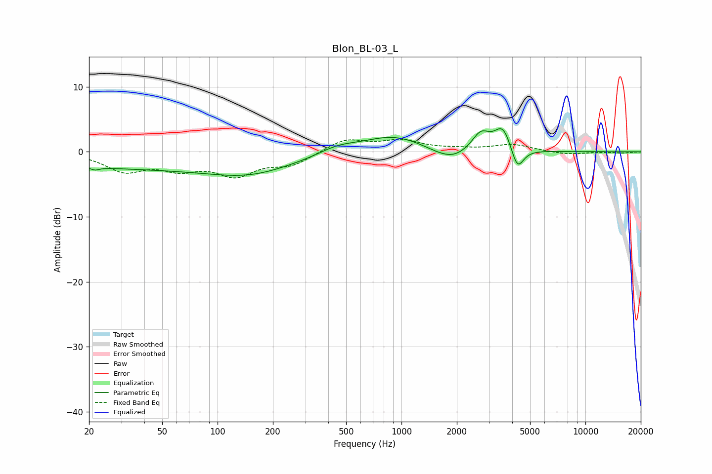

# Blon_BL-03_L
See [usage instructions](https://github.com/jaakkopasanen/AutoEq#usage) for more options and info.

### Parametric EQs
Apply preamp of -3.7 dB when using parametric equalizer.

|   # | Type    |   Fc (Hz) |    Q |   Gain (dB) |
|-----|---------|-----------|------|-------------|
|   1 | Peaking |        21 | 5.97 |        -0.5 |
|   2 | Peaking |        50 | 0.18 |        -2.6 |
|   3 | Peaking |       151 | 0.68 |        -1.6 |
|   4 | Peaking |       448 | 1.34 |         1.1 |
|   5 | Peaking |       898 | 0.84 |         2.5 |
|   6 | Peaking |      1528 | 1.73 |        -0.4 |
|   7 | Peaking |      1904 | 1.7  |        -1.6 |
|   8 | Peaking |      2697 | 2.95 |         2.7 |
|   9 | Peaking |      3562 | 3.08 |         3.8 |
|  10 | Peaking |      4264 | 4.16 |        -3.6 |

### Fixed Band EQs
When using fixed band (also called graphic) equalizer, apply preamp of **-2.0 dB** (if available) and set gains manually with these parameters.

|   # | Type    |   Fc (Hz) |    Q |   Gain (dB) |
|-----|---------|-----------|------|-------------|
|   1 | Peaking |        31 | 1.41 |        -2.7 |
|   2 | Peaking |        62 | 1.41 |        -2.2 |
|   3 | Peaking |       125 | 1.41 |        -3.3 |
|   4 | Peaking |       250 | 1.41 |        -1.9 |
|   5 | Peaking |       500 | 1.41 |         1.9 |
|   6 | Peaking |      1000 | 1.41 |         1.6 |
|   7 | Peaking |      2000 | 1.41 |         0.3 |
|   8 | Peaking |      4000 | 1.41 |         1.1 |
|   9 | Peaking |      8000 | 1.41 |        -0.4 |
|  10 | Peaking |     16000 | 1.41 |        -0.2 |

### Graphs

