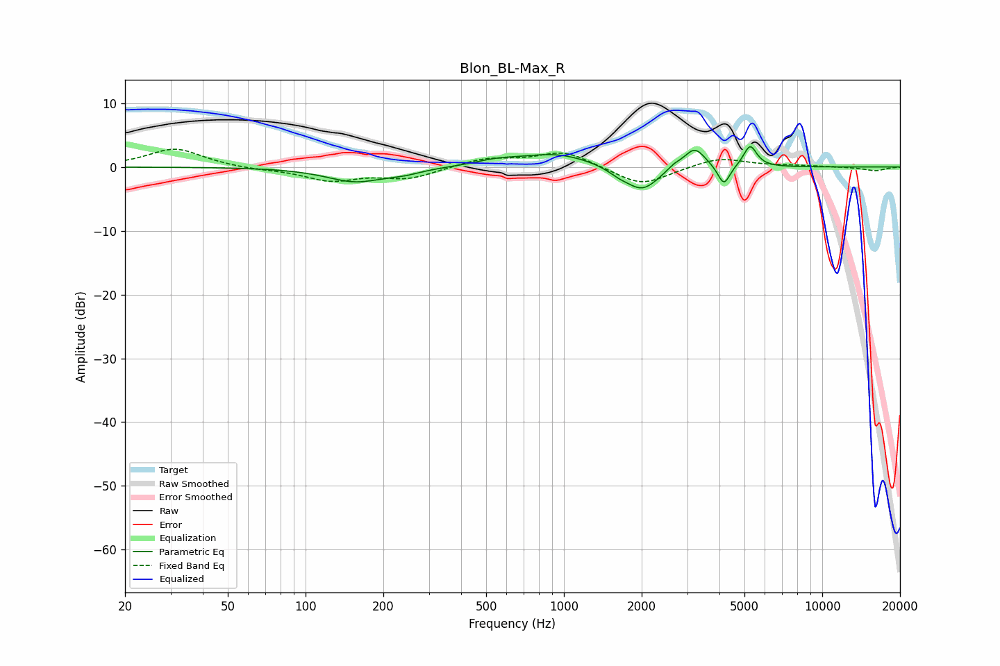

# Blon_BL-Max_R
See [usage instructions](https://github.com/jaakkopasanen/AutoEq#usage) for more options and info.

### Parametric EQs
Apply preamp of -3.3 dB when using parametric equalizer.

|   # | Type    |   Fc (Hz) |    Q |   Gain (dB) |
|-----|---------|-----------|------|-------------|
|   1 | Peaking |       156 | 1.25 |        -2.3 |
|   2 | Peaking |       241 | 2.1  |        -0.6 |
|   3 | Peaking |       549 | 1.73 |         0.7 |
|   4 | Peaking |       936 | 1.02 |         2.1 |
|   5 | Peaking |      1626 | 3.29 |        -0.7 |
|   6 | Peaking |      2010 | 2.15 |        -3.9 |
|   7 | Peaking |      2665 | 5.16 |         0.6 |
|   8 | Peaking |      3204 | 3.46 |         3.2 |
|   9 | Peaking |      4162 | 5.99 |        -3.3 |
|  10 | Peaking |      5259 | 5.52 |         3.4 |

### Fixed Band EQs
When using fixed band (also called graphic) equalizer, apply preamp of **-2.9 dB** (if available) and set gains manually with these parameters.

|   # | Type    |   Fc (Hz) |    Q |   Gain (dB) |
|-----|---------|-----------|------|-------------|
|   1 | Peaking |        31 | 1.41 |         2.9 |
|   2 | Peaking |        62 | 1.41 |        -0.3 |
|   3 | Peaking |       125 | 1.41 |        -2   |
|   4 | Peaking |       250 | 1.41 |        -1.7 |
|   5 | Peaking |       500 | 1.41 |         1.3 |
|   6 | Peaking |      1000 | 1.41 |         2.5 |
|   7 | Peaking |      2000 | 1.41 |        -3   |
|   8 | Peaking |      4000 | 1.41 |         1.5 |
|   9 | Peaking |      8000 | 1.41 |         0.2 |
|  10 | Peaking |     16000 | 1.41 |        -0.6 |

### Graphs

