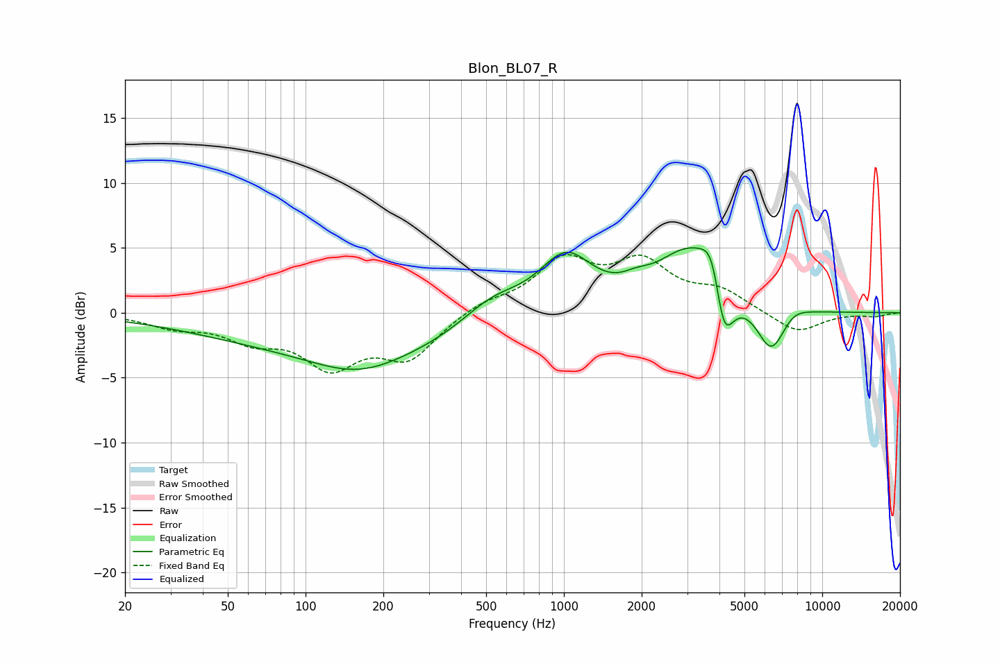

# Blon_BL07_R
See [usage instructions](https://github.com/jaakkopasanen/AutoEq#usage) for more options and info.

### Parametric EQs
Apply preamp of -5.1 dB when using parametric equalizer.

|   # | Type    |   Fc (Hz) |    Q |   Gain (dB) |
|-----|---------|-----------|------|-------------|
|   1 | Peaking |       160 | 0.78 |        -1.9 |
|   2 | Peaking |       203 | 0.18 |        -2.8 |
|   3 | Peaking |       533 | 1.05 |         2.6 |
|   4 | Peaking |      1016 | 1.28 |         4.9 |
|   5 | Peaking |      1898 | 2.63 |         0.6 |
|   6 | Peaking |      3064 | 1.07 |         4.8 |
|   7 | Peaking |      3796 | 3.36 |         4.1 |
|   8 | Peaking |      4130 | 3.48 |        -6.2 |
|   9 | Peaking |      6355 | 2.36 |        -3.8 |
|  10 | Peaking |      7634 | 2.26 |         0.8 |

### Fixed Band EQs
When using fixed band (also called graphic) equalizer, apply preamp of **-4.6 dB** (if available) and set gains manually with these parameters.

|   # | Type    |   Fc (Hz) |    Q |   Gain (dB) |
|-----|---------|-----------|------|-------------|
|   1 | Peaking |        31 | 1.41 |        -0.9 |
|   2 | Peaking |        62 | 1.41 |        -1.8 |
|   3 | Peaking |       125 | 1.41 |        -3.7 |
|   4 | Peaking |       250 | 1.41 |        -3.3 |
|   5 | Peaking |       500 | 1.41 |         0.8 |
|   6 | Peaking |      1000 | 1.41 |         3.8 |
|   7 | Peaking |      2000 | 1.41 |         3.5 |
|   8 | Peaking |      4000 | 1.41 |         1.5 |
|   9 | Peaking |      8000 | 1.41 |        -1.6 |
|  10 | Peaking |     16000 | 1.41 |        -0.3 |

### Graphs

