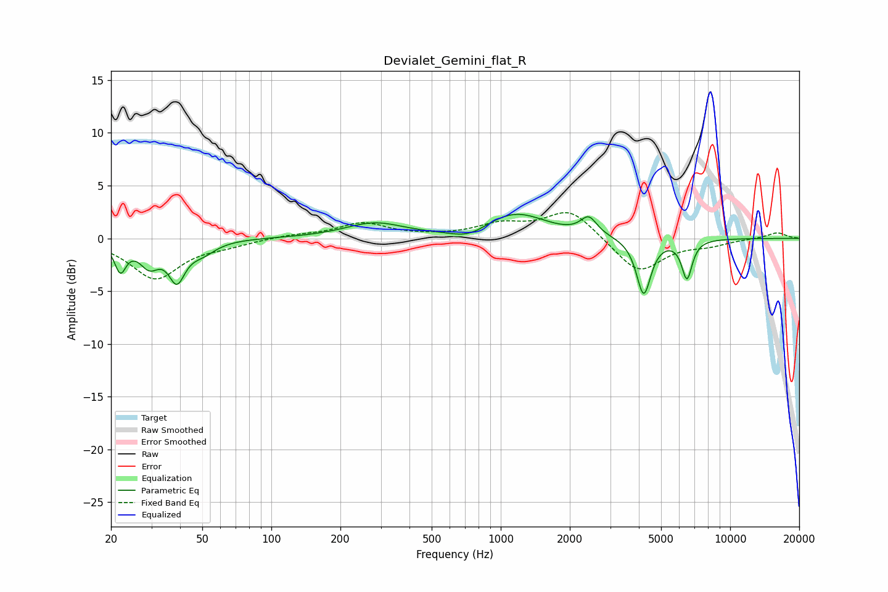

# Devialet_Gemini_flat_R
See [usage instructions](https://github.com/jaakkopasanen/AutoEq#usage) for more options and info.

### Parametric EQs
Apply preamp of -2.4 dB when using parametric equalizer.

|   # | Type    |   Fc (Hz) |    Q |   Gain (dB) |
|-----|---------|-----------|------|-------------|
|   1 | Peaking |        22 | 5.76 |        -2.7 |
|   2 | Peaking |        29 | 3.31 |        -2.2 |
|   3 | Peaking |        39 | 4.02 |        -3.4 |
|   4 | Peaking |        50 | 2.44 |        -1.1 |
|   5 | Peaking |       281 | 1.09 |         1.4 |
|   6 | Peaking |       726 | 1.78 |        -0.9 |
|   7 | Peaking |      1152 | 1.04 |         2.4 |
|   8 | Peaking |      2420 | 4    |         1.6 |
|   9 | Peaking |      4199 | 4.48 |        -5.4 |
|  10 | Peaking |      6482 | 6    |        -3.7 |

### Fixed Band EQs
When using fixed band (also called graphic) equalizer, apply preamp of **-2.5 dB** (if available) and set gains manually with these parameters.

|   # | Type    |   Fc (Hz) |    Q |   Gain (dB) |
|-----|---------|-----------|------|-------------|
|   1 | Peaking |        31 | 1.41 |        -3.8 |
|   2 | Peaking |        62 | 1.41 |        -0.5 |
|   3 | Peaking |       125 | 1.41 |         0.3 |
|   4 | Peaking |       250 | 1.41 |         1.4 |
|   5 | Peaking |       500 | 1.41 |         0.1 |
|   6 | Peaking |      1000 | 1.41 |         1.2 |
|   7 | Peaking |      2000 | 1.41 |         2.7 |
|   8 | Peaking |      4000 | 1.41 |        -3.3 |
|   9 | Peaking |      8000 | 1.41 |        -0.5 |
|  10 | Peaking |     16000 | 1.41 |         0.6 |

### Graphs

