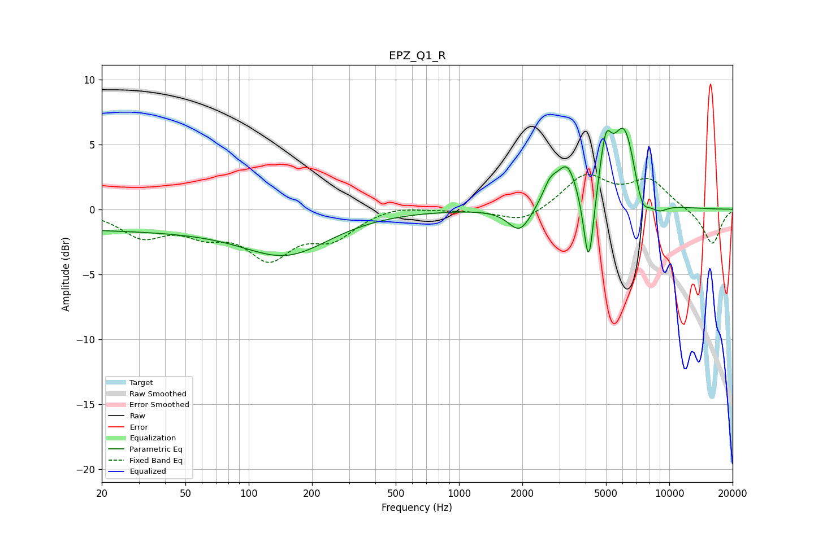

# EPZ_Q1_R
See [usage instructions](https://github.com/jaakkopasanen/AutoEq#usage) for more options and info.

### Parametric EQs
Apply preamp of -6.3 dB when using parametric equalizer.

|   # | Type    |   Fc (Hz) |    Q |   Gain (dB) |
|-----|---------|-----------|------|-------------|
|   1 | Peaking |        25 | 0.18 |        -1.5 |
|   2 | Peaking |       154 | 0.7  |        -2.8 |
|   3 | Peaking |      1945 | 2.62 |        -1.9 |
|   4 | Peaking |      2714 | 3.88 |         1.5 |
|   5 | Peaking |      3271 | 2.99 |         3   |
|   6 | Peaking |      4138 | 5.84 |        -6.2 |
|   7 | Peaking |      4980 | 5.02 |         3.8 |
|   8 | Peaking |      6120 | 2.35 |         6.3 |
|   9 | Peaking |      7397 | 3.72 |        -2.2 |
|  10 | Peaking |      8895 | 2.92 |        -0.7 |

### Fixed Band EQs
When using fixed band (also called graphic) equalizer, apply preamp of **-2.8 dB** (if available) and set gains manually with these parameters.

|   # | Type    |   Fc (Hz) |    Q |   Gain (dB) |
|-----|---------|-----------|------|-------------|
|   1 | Peaking |        31 | 1.41 |        -1.9 |
|   2 | Peaking |        62 | 1.41 |        -1.5 |
|   3 | Peaking |       125 | 1.41 |        -3.4 |
|   4 | Peaking |       250 | 1.41 |        -2   |
|   5 | Peaking |       500 | 1.41 |         0.4 |
|   6 | Peaking |      1000 | 1.41 |        -0   |
|   7 | Peaking |      2000 | 1.41 |        -1.1 |
|   8 | Peaking |      4000 | 1.41 |         2.6 |
|   9 | Peaking |      8000 | 1.41 |         2.1 |
|  10 | Peaking |     16000 | 1.41 |        -2.7 |

### Graphs

