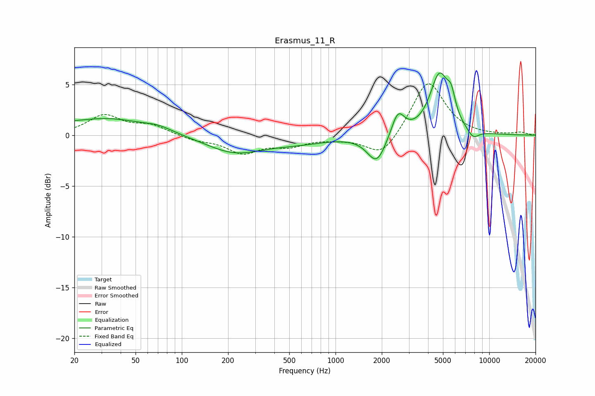

# Erasmus_11_R
See [usage instructions](https://github.com/jaakkopasanen/AutoEq#usage) for more options and info.

### Parametric EQs
Apply preamp of -6.2 dB when using parametric equalizer.

|   # | Type    |   Fc (Hz) |    Q |   Gain (dB) |
|-----|---------|-----------|------|-------------|
|   1 | Peaking |        20 | 4.26 |         0.1 |
|   2 | Peaking |        32 | 0.52 |         1.7 |
|   3 | Peaking |        71 | 1.69 |         0.4 |
|   4 | Peaking |       219 | 0.76 |        -1.7 |
|   5 | Peaking |       573 | 0.71 |        -0.6 |
|   6 | Peaking |      1854 | 2.31 |        -2.8 |
|   7 | Peaking |      2547 | 3.34 |         2.4 |
|   8 | Peaking |      4745 | 2.25 |         5.8 |
|   9 | Peaking |      5659 | 5.24 |         1.9 |
|  10 | Peaking |      7843 | 3.47 |        -0.9 |

### Fixed Band EQs
When using fixed band (also called graphic) equalizer, apply preamp of **-5.2 dB** (if available) and set gains manually with these parameters.

|   # | Type    |   Fc (Hz) |    Q |   Gain (dB) |
|-----|---------|-----------|------|-------------|
|   1 | Peaking |        31 | 1.41 |         1.9 |
|   2 | Peaking |        62 | 1.41 |         0.9 |
|   3 | Peaking |       125 | 1.41 |        -0.5 |
|   4 | Peaking |       250 | 1.41 |        -1.7 |
|   5 | Peaking |       500 | 1.41 |        -0.9 |
|   6 | Peaking |      1000 | 1.41 |        -0.2 |
|   7 | Peaking |      2000 | 1.41 |        -2.2 |
|   8 | Peaking |      4000 | 1.41 |         5.5 |
|   9 | Peaking |      8000 | 1.41 |        -0   |
|  10 | Peaking |     16000 | 1.41 |         0.3 |

### Graphs

