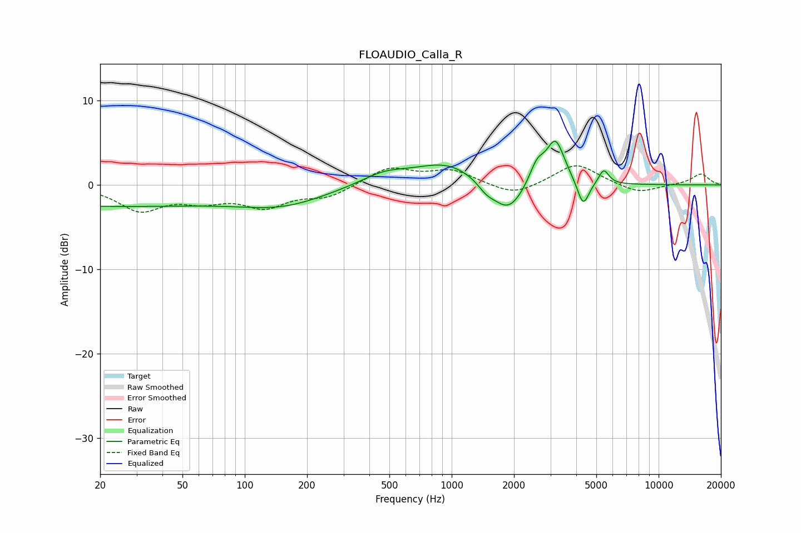

# FLOAUDIO_Calla_R
See [usage instructions](https://github.com/jaakkopasanen/AutoEq#usage) for more options and info.

### Parametric EQs
Apply preamp of -5.3 dB when using parametric equalizer.

|   # | Type    |   Fc (Hz) |    Q |   Gain (dB) |
|-----|---------|-----------|------|-------------|
|   1 | Peaking |        20 | 0.2  |        -2.5 |
|   2 | Peaking |       154 | 0.67 |        -2   |
|   3 | Peaking |       472 | 1.22 |         1.3 |
|   4 | Peaking |       950 | 0.91 |         2.5 |
|   5 | Peaking |      1469 | 3.31 |        -1   |
|   6 | Peaking |      1878 | 1.86 |        -3.7 |
|   7 | Peaking |      2584 | 3.77 |         2.4 |
|   8 | Peaking |      3177 | 3.21 |         5.1 |
|   9 | Peaking |      4320 | 5.06 |        -3.1 |
|  10 | Peaking |      5430 | 5.77 |         1.8 |

### Fixed Band EQs
When using fixed band (also called graphic) equalizer, apply preamp of **-2.4 dB** (if available) and set gains manually with these parameters.

|   # | Type    |   Fc (Hz) |    Q |   Gain (dB) |
|-----|---------|-----------|------|-------------|
|   1 | Peaking |        31 | 1.41 |        -2.9 |
|   2 | Peaking |        62 | 1.41 |        -1.5 |
|   3 | Peaking |       125 | 1.41 |        -2.4 |
|   4 | Peaking |       250 | 1.41 |        -1.4 |
|   5 | Peaking |       500 | 1.41 |         2   |
|   6 | Peaking |      1000 | 1.41 |         1.6 |
|   7 | Peaking |      2000 | 1.41 |        -1.4 |
|   8 | Peaking |      4000 | 1.41 |         2.6 |
|   9 | Peaking |      8000 | 1.41 |        -1.1 |
|  10 | Peaking |     16000 | 1.41 |         1.3 |

### Graphs

