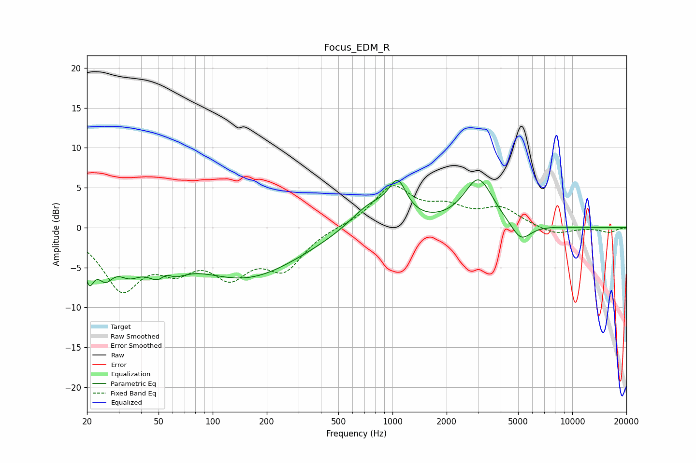

# Focus_EDM_R
See [usage instructions](https://github.com/jaakkopasanen/AutoEq#usage) for more options and info.

### Parametric EQs
Apply preamp of -6.1 dB when using parametric equalizer.

|   # | Type    |   Fc (Hz) |    Q |   Gain (dB) |
|-----|---------|-----------|------|-------------|
|   1 | Peaking |        20 | 4.97 |        -4.5 |
|   2 | Peaking |        25 | 3.04 |        -3.6 |
|   3 | Peaking |        34 | 1.99 |        -3.1 |
|   4 | Peaking |        54 | 2.04 |        -6.1 |
|   5 | Peaking |        55 | 3.34 |         3.6 |
|   6 | Peaking |       152 | 0.46 |        -6.1 |
|   7 | Peaking |       756 | 1.19 |         3.2 |
|   8 | Peaking |      1070 | 2.87 |         4.3 |
|   9 | Peaking |      3010 | 1.74 |         6.1 |
|  10 | Peaking |      5173 | 2.49 |        -2.4 |

### Fixed Band EQs
When using fixed band (also called graphic) equalizer, apply preamp of **-5.3 dB** (if available) and set gains manually with these parameters.

|   # | Type    |   Fc (Hz) |    Q |   Gain (dB) |
|-----|---------|-----------|------|-------------|
|   1 | Peaking |        31 | 1.41 |        -7.2 |
|   2 | Peaking |        62 | 1.41 |        -3.9 |
|   3 | Peaking |       125 | 1.41 |        -5   |
|   4 | Peaking |       250 | 1.41 |        -4.7 |
|   5 | Peaking |       500 | 1.41 |         0.1 |
|   6 | Peaking |      1000 | 1.41 |         5   |
|   7 | Peaking |      2000 | 1.41 |         2   |
|   8 | Peaking |      4000 | 1.41 |         2.3 |
|   9 | Peaking |      8000 | 1.41 |        -1   |
|  10 | Peaking |     16000 | 1.41 |        -0.6 |

### Graphs

