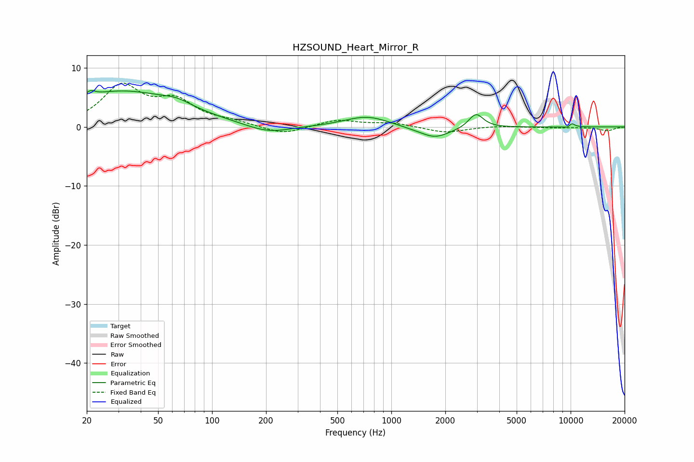

# HZSOUND_Heart_Mirror_R
See [usage instructions](https://github.com/jaakkopasanen/AutoEq#usage) for more options and info.

### Parametric EQs
Apply preamp of -6.3 dB when using parametric equalizer.

|   # | Type    |   Fc (Hz) |    Q |   Gain (dB) |
|-----|---------|-----------|------|-------------|
|   1 | Peaking |        21 | 5.97 |         0.8 |
|   2 | Peaking |        31 | 0.43 |         6   |
|   3 | Peaking |        64 | 1.83 |         0.9 |
|   4 | Peaking |       205 | 1.13 |        -1.4 |
|   5 | Peaking |       733 | 1.14 |         1.9 |
|   6 | Peaking |      1719 | 1.28 |        -1.5 |
|   7 | Peaking |      1764 | 2.46 |        -0.5 |
|   8 | Peaking |      2965 | 3.5  |         2.5 |
|   9 | Peaking |      9920 | 5.65 |        -2.5 |
|  10 | Peaking |     10000 | 5.83 |         2.9 |

### Fixed Band EQs
When using fixed band (also called graphic) equalizer, apply preamp of **-7.5 dB** (if available) and set gains manually with these parameters.

|   # | Type    |   Fc (Hz) |    Q |   Gain (dB) |
|-----|---------|-----------|------|-------------|
|   1 | Peaking |        31 | 1.41 |         6.7 |
|   2 | Peaking |        62 | 1.41 |         3.9 |
|   3 | Peaking |       125 | 1.41 |         0.7 |
|   4 | Peaking |       250 | 1.41 |        -1.4 |
|   5 | Peaking |       500 | 1.41 |         1.2 |
|   6 | Peaking |      1000 | 1.41 |         0.7 |
|   7 | Peaking |      2000 | 1.41 |        -1   |
|   8 | Peaking |      4000 | 1.41 |         0.2 |
|   9 | Peaking |      8000 | 1.41 |        -0.1 |
|  10 | Peaking |     16000 | 1.41 |        -0.6 |

### Graphs

