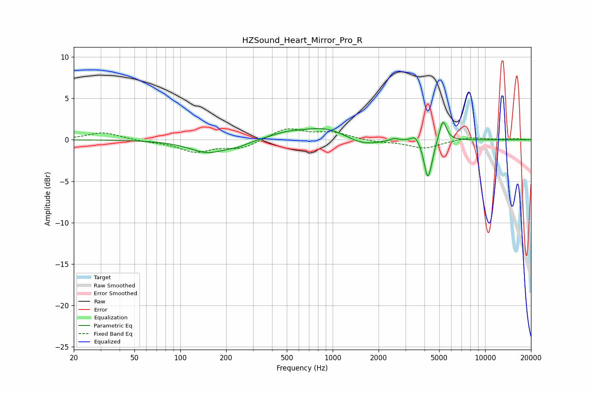

# HZSound_Heart_Mirror_Pro_R
See [usage instructions](https://github.com/jaakkopasanen/AutoEq#usage) for more options and info.

### Parametric EQs
Apply preamp of -2.2 dB when using parametric equalizer.

|   # | Type    |   Fc (Hz) |    Q |   Gain (dB) |
|-----|---------|-----------|------|-------------|
|   1 | Peaking |       152 | 1.17 |        -1.5 |
|   2 | Peaking |       240 | 2.09 |        -0.4 |
|   3 | Peaking |       497 | 1.29 |         0.6 |
|   4 | Peaking |       905 | 0.92 |         1.5 |
|   5 | Peaking |      1567 | 1.24 |        -1   |
|   6 | Peaking |      2534 | 4.83 |         0.3 |
|   7 | Peaking |      3471 | 5.2  |         0.8 |
|   8 | Peaking |      4191 | 6    |        -4.2 |
|   9 | Peaking |      4440 | 6    |        -0.9 |
|  10 | Peaking |      5284 | 5.82 |         2.6 |

### Fixed Band EQs
When using fixed band (also called graphic) equalizer, apply preamp of **-1.4 dB** (if available) and set gains manually with these parameters.

|   # | Type    |   Fc (Hz) |    Q |   Gain (dB) |
|-----|---------|-----------|------|-------------|
|   1 | Peaking |        31 | 1.41 |         0.9 |
|   2 | Peaking |        62 | 1.41 |        -0.2 |
|   3 | Peaking |       125 | 1.41 |        -1.4 |
|   4 | Peaking |       250 | 1.41 |        -1   |
|   5 | Peaking |       500 | 1.41 |         1.4 |
|   6 | Peaking |      1000 | 1.41 |         0.8 |
|   7 | Peaking |      2000 | 1.41 |        -0.3 |
|   8 | Peaking |      4000 | 1.41 |        -1   |
|   9 | Peaking |      8000 | 1.41 |         0.3 |
|  10 | Peaking |     16000 | 1.41 |         0.1 |

### Graphs

