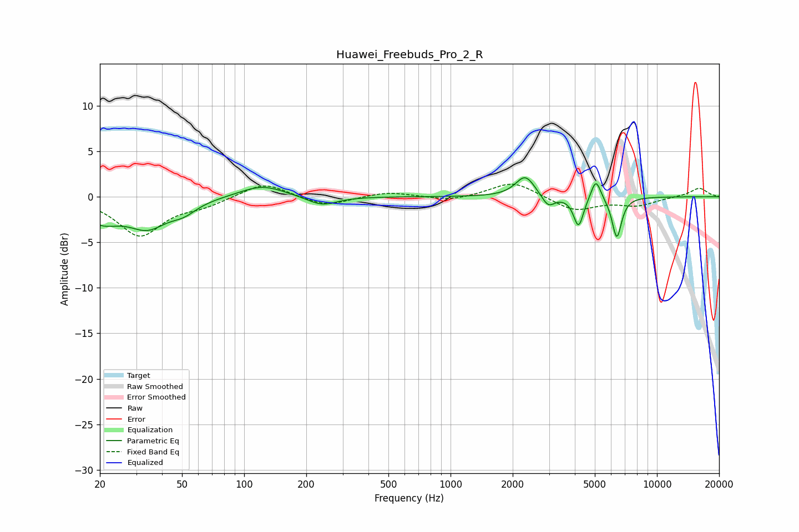

# Huawei_Freebuds_Pro_2_R
See [usage instructions](https://github.com/jaakkopasanen/AutoEq#usage) for more options and info.

### Parametric EQs
Apply preamp of -2.2 dB when using parametric equalizer.

|   # | Type    |   Fc (Hz) |    Q |   Gain (dB) |
|-----|---------|-----------|------|-------------|
|   1 | Peaking |        20 | 1.52 |        -2.3 |
|   2 | Peaking |        34 | 1.48 |        -2.9 |
|   3 | Peaking |        51 | 2.22 |        -1.1 |
|   4 | Peaking |       122 | 1.3  |         1.3 |
|   5 | Peaking |       238 | 1.93 |        -1   |
|   6 | Peaking |      2301 | 3.05 |         2.3 |
|   7 | Peaking |      2973 | 4.57 |        -1.3 |
|   8 | Peaking |      4170 | 5.94 |        -3.3 |
|   9 | Peaking |      5060 | 6    |         2.3 |
|  10 | Peaking |      6390 | 6    |        -4.5 |

### Fixed Band EQs
When using fixed band (also called graphic) equalizer, apply preamp of **-1.5 dB** (if available) and set gains manually with these parameters.

|   # | Type    |   Fc (Hz) |    Q |   Gain (dB) |
|-----|---------|-----------|------|-------------|
|   1 | Peaking |        31 | 1.41 |        -4.2 |
|   2 | Peaking |        62 | 1.41 |        -0.8 |
|   3 | Peaking |       125 | 1.41 |         1.7 |
|   4 | Peaking |       250 | 1.41 |        -1.1 |
|   5 | Peaking |       500 | 1.41 |         0.6 |
|   6 | Peaking |      1000 | 1.41 |        -0.5 |
|   7 | Peaking |      2000 | 1.41 |         1.7 |
|   8 | Peaking |      4000 | 1.41 |        -1.5 |
|   9 | Peaking |      8000 | 1.41 |        -0.9 |
|  10 | Peaking |     16000 | 1.41 |         1   |

### Graphs

