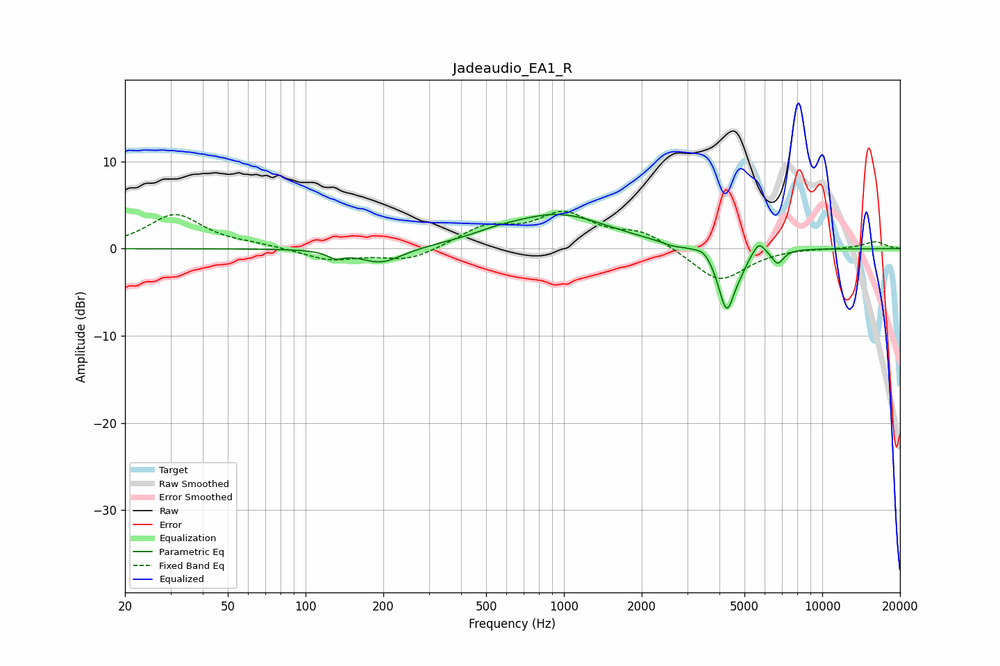

# Jadeaudio_EA1_R
See [usage instructions](https://github.com/jaakkopasanen/AutoEq#usage) for more options and info.

### Parametric EQs
Apply preamp of -4.0 dB when using parametric equalizer.

|   # | Type    |   Fc (Hz) |    Q |   Gain (dB) |
|-----|---------|-----------|------|-------------|
|   1 | Peaking |       131 | 4.6  |        -0.8 |
|   2 | Peaking |       196 | 1.72 |        -1.8 |
|   3 | Peaking |       546 | 1.64 |         0.4 |
|   4 | Peaking |       947 | 0.71 |         3.9 |
|   5 | Peaking |      2633 | 3.5  |        -0.3 |
|   6 | Peaking |      3484 | 5.16 |         0.6 |
|   7 | Peaking |      4268 | 4.24 |        -7.1 |
|   8 | Peaking |      4832 | 5.85 |        -0.7 |
|   9 | Peaking |      5682 | 6    |         1.4 |
|  10 | Peaking |      6727 | 6    |        -1.6 |

### Fixed Band EQs
When using fixed band (also called graphic) equalizer, apply preamp of **-4.4 dB** (if available) and set gains manually with these parameters.

|   # | Type    |   Fc (Hz) |    Q |   Gain (dB) |
|-----|---------|-----------|------|-------------|
|   1 | Peaking |        31 | 1.41 |         3.9 |
|   2 | Peaking |        62 | 1.41 |         0.3 |
|   3 | Peaking |       125 | 1.41 |        -1.3 |
|   4 | Peaking |       250 | 1.41 |        -1.4 |
|   5 | Peaking |       500 | 1.41 |         2.3 |
|   6 | Peaking |      1000 | 1.41 |         3.7 |
|   7 | Peaking |      2000 | 1.41 |         1.8 |
|   8 | Peaking |      4000 | 1.41 |        -3.9 |
|   9 | Peaking |      8000 | 1.41 |         0.1 |
|  10 | Peaking |     16000 | 1.41 |         0.8 |

### Graphs

