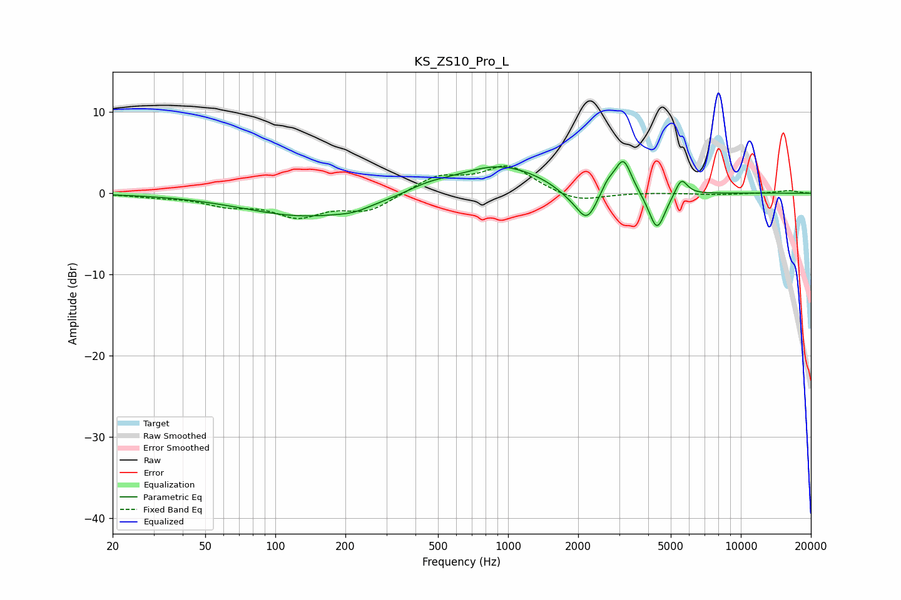

# KS_ZS10_Pro_L
See [usage instructions](https://github.com/jaakkopasanen/AutoEq#usage) for more options and info.

### Parametric EQs
Apply preamp of -4.0 dB when using parametric equalizer.

|   # | Type    |   Fc (Hz) |    Q |   Gain (dB) |
|-----|---------|-----------|------|-------------|
|   1 | Peaking |       139 | 0.52 |        -2.9 |
|   2 | Peaking |       217 | 2.22 |        -0.5 |
|   3 | Peaking |       450 | 1.6  |         0.7 |
|   4 | Peaking |       915 | 0.72 |         3.5 |
|   5 | Peaking |      1821 | 2.15 |        -0.9 |
|   6 | Peaking |      2182 | 3.1  |        -3.9 |
|   7 | Peaking |      2679 | 4.8  |         1.2 |
|   8 | Peaking |      3128 | 4.01 |         4.2 |
|   9 | Peaking |      4363 | 3.94 |        -4.8 |
|  10 | Peaking |      5550 | 5.36 |         2.1 |

### Fixed Band EQs
When using fixed band (also called graphic) equalizer, apply preamp of **-3.5 dB** (if available) and set gains manually with these parameters.

|   # | Type    |   Fc (Hz) |    Q |   Gain (dB) |
|-----|---------|-----------|------|-------------|
|   1 | Peaking |        31 | 1.41 |        -0.3 |
|   2 | Peaking |        62 | 1.41 |        -1.3 |
|   3 | Peaking |       125 | 1.41 |        -2.6 |
|   4 | Peaking |       250 | 1.41 |        -2.1 |
|   5 | Peaking |       500 | 1.41 |         2   |
|   6 | Peaking |      1000 | 1.41 |         3.3 |
|   7 | Peaking |      2000 | 1.41 |        -1.2 |
|   8 | Peaking |      4000 | 1.41 |         0.1 |
|   9 | Peaking |      8000 | 1.41 |        -0.2 |
|  10 | Peaking |     16000 | 1.41 |         0.3 |

### Graphs

